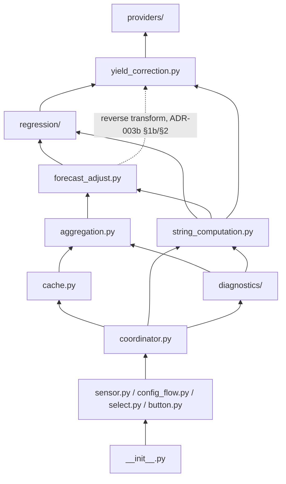

# ADR-000 – Code Quality Standards, Programming Style & Core Concepts

**Date:** 2026-07-04
**Status:** Accepted
**Amended:** 2026-07-05 — §3 (module diagram/prose) and §5 updated to
reflect `cache.py` (ADR-007) and `aggregation.py` (ADR-005) once
accepted, and to cross-reference the diagnostics-gating entity (ADR-004
§1) — originally `ShadyDiagnosticsSwitch`, since 2026-08-30
`ShadyDiagnosticModeSelect`, see below.
**2026-08-14** — §3 (`providers/`, `config_flow.py` pointers) updated
for ADR-001's split into ADR-009/ADR-010.
**2026-08-19** — §7 amended to require `adr/INDEX.md` be kept in sync
with any structural change to the ADR set; §3's `cache.py` bullet
updated for ADR-007's split into ADR-007/ADR-007a; §3's dependency-
direction paragraph now points to §6's module list instead of
re-enumerating it, matching §2's existing single-source-of-truth note.
**2026-08-20** — §6's zero-mocking module list updated: `providers/base.py`
added (holds ADR-012 §1a's two shared helpers as of the same date), and
`providers/temperature.py` added as a second `hass`-fixture exception
alongside `providers/discovery.py`, matching what ADR-012 §5 already
assumed this section said. §2's typing-tier scope is unchanged in
wording but now resolves correctly for both modules, since §2 already
points here rather than re-enumerating. §3's `coordinator.py` bullet
updated to note the provider-push listeners ADR-012 §4 added, alongside
its existing scheduling triggers.
**2026-08-30** — §2's mypy-suppression module list and §3's diagram/prose
updated for ADR-004's amendment: `switch.py` is removed (nothing else in
the project used the `switch` platform); `select.py` (`ShadyDiagnosticModeSelect`)
takes its place in the HA-facing entity-glue tier. §6's zero-mocking list
gains the new pure package `diagnostics/` (`base.py` and
`compare_regressions.py`), mirroring how `providers/base.py` was added on
2026-08-20 for the same reason (ADR-012 §1).
**2026-08-31** — §3's diagram/prose and §6's zero-mocking list updated for
ADR-014: new pure module `string_computation.py`, extracted from
`coordinator.py`'s own private methods (see ADR-014 for the full
rationale — discovered while scoping `TASK-0015b`'s diagnostics work).
The `diagnostics --> regression` edge is replaced by
`diagnostics --> string_computation`; `coordinator.py`'s bullet is
updated to reflect its narrower, orchestration-only role.

## Amendment — 2026-08-22

**Reason:** Home Assistant 2026.3 (the current HA release is 2026.8.2) raised HA's
own minimum supported Python version to 3.14. §4's rationale for
`from __future__ import annotations` ("without requiring Python 3.10+ at
runtime — HA's actual minimum is lower") is now stale: HA's actual
minimum is no longer lower, it is 3.14. As a direct consequence,
`pyproject.toml` (`requires-python`, `[tool.mypy] python_version`) and
`hacs.json` (`homeassistant` minimum) are amended to match, so a HACS
install can no longer advertise compatibility with an HA release whose
bundled Python predates the interpreter this codebase now targets.
**Decision:** Python ≥3.14 is the project's minimum supported runtime.
§4's first bullet is updated accordingly (see below). `pyproject.toml`'s
`requires-python` is raised to `>=3.14` and `[tool.mypy] python_version`
to `"3.14"`; `hacs.json`'s `homeassistant` minimum is raised to
`"2026.3"`. `tasks/adr-summary.md` §1 is updated to match.
**Decided by:** human (confirmed by Lead Agent).

---

## Context

This ADR documents the overarching engineering conventions used throughout
the Shady codebase. It exists so that contributors and future maintainers can
understand *why* the code looks the way it does without having to infer it
from individual diffs. The numbered ADRs (001 onward) cover specific
domain decisions (e.g. the empirical per-slot regression model, coordinator
update/recalibration strategy, cross-string aggregation); this one covers
everything that applies uniformly across all files.

This document is adapted from the sibling project
[Effy](https://github.com/eschnepel/effy)'s ADR-000, so that both projects
share a consistent engineering baseline. Sections specific to Effy's domain
(loss distribution) have been replaced with Shady's own module boundaries.

---

## Decision

### 1 — Tooling: ruff, mypy strict, pytest

Three tools gate every change, run via `.github/workflows/ci.yml`:

| Tool | Purpose | Invocation |
|---|---|---|
| `ruff format` | Code formatting (replaces black) | `ruff format custom_components/` |
| `ruff check` | Linting (replaces flake8/isort/pyupgrade) | `ruff check custom_components/` |
| `mypy --strict` | Static type checking | `mypy custom_components/shady tests --config-file mypy.ini` |
| `pytest` | Unit tests | `pytest tests/` |

All four must pass with zero errors before a change is considered complete.
`mypy --strict` is non-negotiable: every function signature carries full
type annotations, including return types on methods that return `None`.

### 2 — Handling Home Assistant's untyped surface

Home Assistant ships without inline type stubs for many of its base classes
and decorators (`SensorEntity`, `ConfigFlow`, `@callback`, etc.). Under
`mypy --strict` this produces two categories of unavoidable noise:

- `misc` errors when subclassing a base class typed as `Any`.
- `untyped-decorator` errors when `@callback` wraps a method.

These are suppressed **per-file**, not globally, via `mypy.ini`
(`warn_unused_ignores = False` on the specific modules that subclass HA
entities or use `@callback`), combined with targeted
`# type: ignore[<code>]` comments at the exact line mypy flags. Suppression
is never broad (no bare `# type: ignore` without a code, no
`disable_error_code` at the global `[mypy]` level) — the goal is to silence
exactly the HA-stub gap, not to weaken type checking elsewhere.

The comment goes on the exact source line mypy reports, not on a nearby
line: `misc` errors on subclassing are attached to the base-class entry in
the class statement (e.g. `class ShadySensor(SensorEntity):  # type:
ignore[misc]`), and `untyped-decorator` errors are attached to the
`@callback` line itself, not the `def` line below it — mypy's reported line
number is authoritative and should never be guessed at.

The HA-facing modules this suppression applies to are `config_flow.py`,
`sensor.py`, `coordinator.py`, `select.py` (`ShadyDiagnosticModeSelect`,
ADR-004 §1, replacing `switch.py` as of the 2026-08-30 amendment), and
`button.py`.

The modules held to this full, unsuppressed strict standard are exactly
the zero-Home-Assistant-import, pure-Python tier — see §6 for the
canonical list. A module belongs to this typing tier if and only if it
is also in §6's zero-mocking test tier; the two are the same boundary
described from two different angles, so the list itself is kept in one
place (§6) rather than duplicated here.

### 3 — Module boundaries and dependency direction



- **`providers/`** (`discovery.py`, `normalize.py`, `base.py`,
  `temperature.py`) — pure-ish: reads external time series from whatever
  HA entity exposes them, behind the shared `base.py` base class defined
  in ADR-012 — that document is the source of truth for what `providers/`
  contains and why. `discovery.py` + `normalize.py` discover and
  normalize the forecast/sunshine/cloud-coverage baseline series (ADR-009);
  `temperature.py` resolves the config-flow-selected temperature source
  (ADR-003b §1a). Both read `hass.states` only — no writes, no
  coordinator/internal API access.
- **`yield_correction.py`** — pure logic: optional per-string clipping
  exclusion (ADR-003a) + temperature derating correction (ADR-003b),
  no-op if not configured. Used at two points in the pipeline, not only
  the one upward edge above: `regression/` calls it forward to prepare
  training data, and `forecast_adjust.py` calls back into it in reverse
  (the dashed edge above) to finish a prediction — see ADR-003b §2 for
  the detailed view of this module alone.
- **`regression/`** (`base.py`, `kernel.py`, `linear.py`, `wls2.py`,
  `wls3.py`) — pure logic: pluggable per-string, per-5-minute-slot
  regression strategy — linear/kernel/wls2/wls3, fitting actual yield as
  a function of the raw forecast value — fit + predict with a shared
  confidence definition; see ADR-001/ADR-002.
- **`forecast_adjust.py`** — pure logic: applies a string's fitted
  per-slot model to its raw baseline series.
- **`string_computation.py`** — pure logic: the shared per-string
  fit/predict computation — training-time corrections, the
  regression-method registry and fit call, and the predict-then-
  reverse-transform-then-clamp sequence — factored out of
  `coordinator.py` and out of a would-be duplicate inside `diagnostics/`
  alike; slot-count-agnostic, so the same functions serve
  `coordinator.py`'s 288-slot sweep and `diagnostics/`'s single
  diagnosed slot. See ADR-014 for the source of truth.
- **`aggregation.py`** — pure logic: cross-string sums, whole-day arrays,
  trapezoidal energy-increment calculation, and the diagnostic accuracy
  calculation (mode-independent, ADR-004 §5) — see ADR-005/ADR-004.
- **`diagnostics/`** (`base.py`, `compare_regressions.py`) — pure logic:
  shared `DiagnosticMode` base class (mirrors `providers/base.py`'s
  `Provider` ABC, ADR-012 §1) plus one concrete mode today,
  `CompareRegressionsMode`; see ADR-004 §1/§5 (Amendment, 2026-08-30) for
  the source of truth. Calls `string_computation.py` for its own extra
  per-slot fitting (ADR-014) and `aggregation.py` for the accuracy
  calculation; imports neither `cache.py` nor `homeassistant.*` —
  `coordinator.py` builds each mode's input context from already-fetched
  cache data and persists whatever a mode's `extra_fit()` returns, the
  same division of labor it already has for `push()`-ing a provider's
  `forward()` result.
- **`cache.py`** — pure logic: index-addressable time-series store,
  generic over any `sensor_id` (used for FC/PV history and the
  day-snapshot array, and, per ADR-003c, weather-forecast/cell-or-ambient
  temperature pairs), plus simple dict stores for the model cache and
  ramp state, and the persisted integral totals; no
  HA imports, constructed with an injected `fetch_fn` so it never imports
  the recorder API itself; see ADR-007 for why the module exists,
  ADR-007a for its storage/accessor design.
- **`coordinator.py`** — orchestrates: registers all scheduling triggers,
  plus, per ADR-012 §4, one generic listener per `forward()`-implementing
  provider (push-only — a second, distinct kind of registration from the
  scheduling triggers, see ADR-012 §4), reads raw data from `cache.py`/
  `providers/` and hands it to `string_computation.py` (ADR-014) for the
  actual fit/predict computation, decides which cache instances get
  restart-persisted, pushes results to sensors — the only module that
  imports `cache.py`. As of ADR-014, `coordinator.py` no longer performs
  the fit/correction/predict computation itself (previously
  `_apply_training_corrections` and inlined build-pool/fit/
  reverse-transform sequences) — that moved to `string_computation.py`,
  narrowing this module back toward its own stated orchestration-only
  scope. Also holds the `_DIAGNOSTIC_MODES` registry (mirrors
  `string_computation.py`'s `REGRESSION_STRATEGIES` lookup) and
  dispatches to the currently selected `DiagnosticMode`'s `extra_fit()`
  generically at the recalibration trigger (ADR-004 §1/§5, Amendment
  2026-08-30) — a third dispatch shape alongside scheduling triggers and
  provider listeners, all three registered/checked once in
  `coordinator.py` rather than scattered per caller.
- **`sensor.py` / `config_flow.py` / `select.py` / `button.py`** — HA
  entity glue. `config_flow.py` implements the flow shape in ADR-010;
  `select.py` is `ShadyDiagnosticModeSelect` (ADR-004 §1, replacing
  `switch.py` as of the 2026-08-30 amendment); `button.py` is
  `ShadyRecalculateButton` (ADR-002 §5).
- **`__init__.py`** — wires platforms + coordinator into `hass.data`.

Dependencies point upward only. The pure-tier modules (§6's canonical
list) never import from any HA-facing module, and never import
`homeassistant.*` directly. `providers/discovery.py` is
the one exception within `providers/`: it
necessarily reads `hass.states`/`hass.config_entries` to discover and read
other integrations' entities, but is still isolated from `coordinator.py`'s
orchestration concerns and never touches the recorder or writes state. This
separation is what allows the shading/forecast math itself to be
unit-tested in complete isolation from Home Assistant (see §6), independent
of which upstream PV forecast or weather integration is supplying the
baseline.

### 4 — Type-hinting conventions

- `from __future__ import annotations` at the top of every module — allows
  modern `list[str] | None` syntax without runtime evaluation cost.
  The project's minimum supported runtime is Python 3.14 (Amendment,
  2026-08-22 — matching HA 2026.3's minimum), which already
  supports this syntax natively; the import is kept for the deferred-
  evaluation cost benefit and as defense-in-depth should the minimum
  ever need to be lowered again, not because a lower minimum requires it.
- Built-in generics (`list[str]`, `dict[str, float]`) are used directly;
  `typing.List`/`typing.Dict` are never imported.
- `X | None` is used instead of `Optional[X]`.
- Every function and method has a complete signature: parameter types and
  a return type, including `-> None`. This applies to private helpers
  (e.g. `_kernel_weight`, `_clamp_output`) and test code exactly as
  it does to public HA-facing methods — `mypy --strict` does not
  distinguish, and a single unannotated parameter triggers `no-untyped-def`
  just as an entirely bare signature does.
- `@dataclass` is used for plain data containers (`WeightedSample`,
  `FittedModel`) instead of dicts or named tuples — gives
  attribute access, auto-generated `__init__`/`__repr__`/`__eq__`, and a
  single place to add validation later if needed.
- **`numpy` arrays are typed with their element dtype, never bare.** Every
  `numpy.ndarray`-valued parameter, return type, and attribute uses
  `numpy.typing.NDArray[np.float64]` (this project's numeric backend is
  `float64` throughout, ADR-008 §1) — never a bare `np.ndarray`, which
  mypy accepts but which drops the dtype half of the type entirely. Same
  rationale as the `X | None` / built-in-generics rules above: `mypy
  --strict` does not itself force this (a bare `np.ndarray` type-checks
  cleanly), so it is a project convention, applied uniformly, rather than
  a gate the tooling already enforces on its own.

## Amendment — 2026-08-22

**Reason:** §4's type-hinting conventions never specified how `numpy`
arrays should be typed. TASK-0005 (`regression/`) and TASK-0007
(`yield_correction.py`) — both already `done` — used bare `np.ndarray`
throughout, which `mypy --strict` accepts but which is genuinely less
precise than the rest of §4's own standard (every other convention in
this section exists specifically to keep a signature's *exact* type
information visible, not just present).
**Decision:** Every `numpy.ndarray`-valued type — parameter, return
type, `@dataclass` attribute — is written `numpy.typing.NDArray[np.float64]`,
never a bare `np.ndarray`. Retrofitted onto TASK-0005/TASK-0007's already-
delivered files via patch tasks (Scenario C: `TASK-0005-patch-1`,
`TASK-0007-patch-1`) rather than reopening either `done` task; every task
from TASK-0006 onward uses the convention from the outset.
**Decided by:** human (explicit instruction), confirmed by Lead Agent.

### 5 — Naming and structure

- Module-level constants are `UPPER_SNAKE_CASE` and live in `const.py`
  (cross-module) or at the top of the module that owns them (single-use,
  e.g. `DEFAULT_POLL_INTERVAL` in `coordinator.py`).
- Private helpers are prefixed with a single underscore (`_kernel_weight`,
  `_slot_key_for_timestamp`) and are not exported.
- HA-facing entities (`ShadyForecastSensor`, `ShadyCoordinator`,
  `ShadyConfigFlow`, `ShadyOptionsFlow`) are all prefixed `Shady` for
  discoverability when grepping or reading stack traces.
- One concept per module: `providers/` only discovers and normalizes
  third-party baseline data, each module in `regression/` implements
  exactly one fitting strategy behind the shared `base.py` protocol,
  `forecast_adjust.py` only applies a fitted model to a forecast series,
  `cache.py` only stores and retrieves state (ADR-007), `coordinator.py`
  only orchestrates. A module that starts doing two unrelated things is a
  signal to split it.

### 6 — Testing philosophy

- Every module in `providers/base.py`, `providers/normalize.py`,
  `yield_correction.py`, `regression/`, `forecast_adjust.py`,
  `string_computation.py` (ADR-014, 2026-08-31), `aggregation.py`,
  `cache.py`, and `diagnostics/` (`base.py`, `compare_regressions.py`,
  ADR-004 §1/§5 Amendment, 2026-08-30) is unit-tested with **zero
  mocking**
  — no `unittest.mock`, no fake `hass` object. Because they have no
  Home Assistant dependency, tests call the real functions with real
  dataclass instances and assert on real return values. This is only
  possible *because* of the module boundary in §3; it is the practical
  payoff of that design choice. Two modules are the exception, both for
  the same reason — each reads `hass.states` directly by design (ADR-009
  §4, ADR-012 §5): `providers/discovery.py` and `providers/temperature.py`.
  Both are tested against a real `hass` fixture instead.
- Tests are loaded via direct file-path import
  (`importlib.util.spec_from_file_location`) rather than package import,
  specifically to avoid pulling in `custom_components/shady/__init__.py`
  (which imports `homeassistant.*`) just to test a dependency-free module.
  This keeps the test environment lightweight (`pytest` only — no
  `pytest-homeassistant-custom-component` needed).
- Because file-path loading yields plain `ModuleType` objects, mypy cannot
  see the real classes on attributes such as `_kernel_mod.FittedModel` —
  it only sees `Any`. Test files still get full static typing for these
  names via a `TYPE_CHECKING`-only static import that mirrors the runtime
  path (`if TYPE_CHECKING: from shady.regression.kernel import FittedModel
  as FittedModel`). This import is never executed (it runs only under
  static analysis), so it does not reintroduce the `homeassistant`
  dependency the file-path loading was designed to avoid; the runtime
  assignment (`FittedModel = _kernel_mod.FittedModel`) is correspondingly
  guarded with `if not TYPE_CHECKING:` so the two bindings never conflict.
  This is mandatory for any test module that binds a dynamically-loaded
  class to a name used later as a type annotation — leaving it untyped
  cascades into dozens of unrelated `attr-defined`/`valid-type` mypy
  errors on every usage of that name, rather than a single fixable root
  cause.
- Every test class documents the scenario it covers in a docstring or
  comment, so the intent behind a fixture (e.g. "a hard shading edge
  crossing mid-window" or "an inverter clipping at high FC") is clear
  without having to re-derive it from the numbers alone.
- Invariant checks (e.g. `0.0 <= corrected_output <= FC` — or `<=
  min(FC, inverter_limit)` when a clipping limit is configured, per
  ADR-001 §2 / ADR-003a §1a — for every sample) are asserted explicitly in
  tests, not just spot-checked values — these are the most important
  correctness guarantees of the whole system and are tested as
  first-class assertions in every scenario class. Each of the four
  `regression/` strategies is tested against the same shared scenario
  fixtures (see ADR-001 §2), so their outputs are comparable rather than
  each having its own bespoke test data.

### 7 — Documentation: ADRs over inline essays

Design rationale lives in `adr/`, not in large module docstrings or inline
comment blocks. Module docstrings stay short (what the module does, 1–3
sentences); the *why* behind non-obvious decisions is captured once in an
ADR and referenced by number from the code (e.g. `# Downweight near-zero
baseline samples (ADR-001 §2)`). This avoids rationale drifting out of
sync with the code, since an ADR is versioned independently and can be
marked `Superseded` if a decision changes, without having to hunt down
every comment that explained it.

**[`adr/INDEX.md`](INDEX.md) is the single, authoritative list of every
ADR and its current status** — not this document, and not the project
README (which only links to it). Updating it is a **mandatory** part of
any structural change to the ADR set, in the same commit as the change
itself, not a follow-up: adding a new ADR, splitting one (as ADR-001 and
ADR-003 each were), marking one `Superseded`, or otherwise changing an
ADR's `Status` header all require a matching edit to `adr/INDEX.md`. This
exists because status and split/supersession relationships are exactly
the kind of fact that is easy to update in the ADR itself while
forgetting the one other place it is also recorded — the same class of
drift §9's Con already accepts for module diagrams vs. their adjacent
prose, addressed here for the ADR set's own index the same way.

### 8 — Error handling

- User-facing errors (config flow validation, e.g. an unresolvable
  baseline candidate or an unreachable actual-yield entity) return error
  keys resolved via `translations/*.json`, never raw exception text — keeps
  the UI translatable and avoids leaking internals.
- Background failures (baseline refresh, coordinator recalibration) are
  logged via `_LOGGER.exception`/`_LOGGER.warning` and swallowed rather
  than raised, since these run outside a request/response cycle where
  there is no caller to propagate the exception to.
- The pure calculation modules (every module in `regression/`,
  `forecast_adjust.py`) raise no exceptions in their normal operating
  range; they use `min`/`max` clamps (e.g. predicted output clamped to
  `[0, FC]`, per ADR-001 §2) instead of validation errors, because the
  inputs are derived from live sensor/forecast data and configuration that
  is expected to occasionally be noisy rather than invalid.

### 9 — Diagrams and tables: Markdown/Mermaid-native, not ASCII art

Structural diagrams (module dependency graphs, data-flow pipelines, state
machines) are written as Mermaid code blocks (` ```mermaid `), not as
hand-drawn ASCII boxes/arrows inside a plain code fence — Mermaid renders
natively on GitHub and in most Markdown viewers, where ASCII art
frequently misaligns once line-wrapped, font-substituted, or viewed on a
narrow screen. Tabular data is written as a native Markdown table
(`| ... | ... |` with a header separator row), not hand-aligned with
manual spacing in a code fence, for the same reason — every table
already in this ADR set follows this. Per-node/per-module explanatory
prose belongs in an adjacent bullet list next to the diagram, not
crammed inside the diagram's own node labels — a diagram should show
*structure* (what depends on what, what calls back into what), prose
explains *why*, and the two don't have to fight for space in the same
box. Plain code fences remain the right tool for what they were always
for: formulas (e.g. `time_weight_i = 1 - distance_i /
(smoothing_radius + 1)`), type/data-shape sketches (e.g. `dict[sensor_id:
str, list[float | None | str]]`), and short illustrative
data/config examples — none of these are themselves diagrams or tables,
so this rule does not apply to them.

---

## Consequences

- **Pro:** A new contributor can run four commands
  (`ruff format --check`, `ruff check`, `mypy --strict`, `pytest`) and know
  immediately whether their change meets the bar.
- **Pro:** The pure-logic/HA-glue split makes the regression and shading
  math trivially testable and reusable (e.g. it could power a non-HA CLI
  tool or a different forecast source unchanged).
- **Pro:** ADRs prevent "tribal knowledge" about *why* a clamp, an
  interpolation choice, or a suppression exists from living only in a pull
  request that gets buried.
- **Pro:** Mermaid diagrams (§9) render correctly on GitHub and in editor
  previews without depending on a monospace font staying aligned — an
  ASCII-art box diagram that looks fine in one viewer can silently
  misalign in another, which a rendered diagram cannot do.
- **Con:** Splitting a module diagram's structure (Mermaid nodes/edges)
  from its explanatory detail (an adjacent bullet list, per §9) means two
  places to keep in sync instead of one self-contained ASCII block — an
  edit that adds a module needs both the diagram and the list updated.
- **Con:** Strict mypy plus per-file suppression configuration is more
  upfront setup than "just ignore HA imports everywhere" — but it means type
  errors in actual business logic are never silently masked by a blanket
  ignore.
