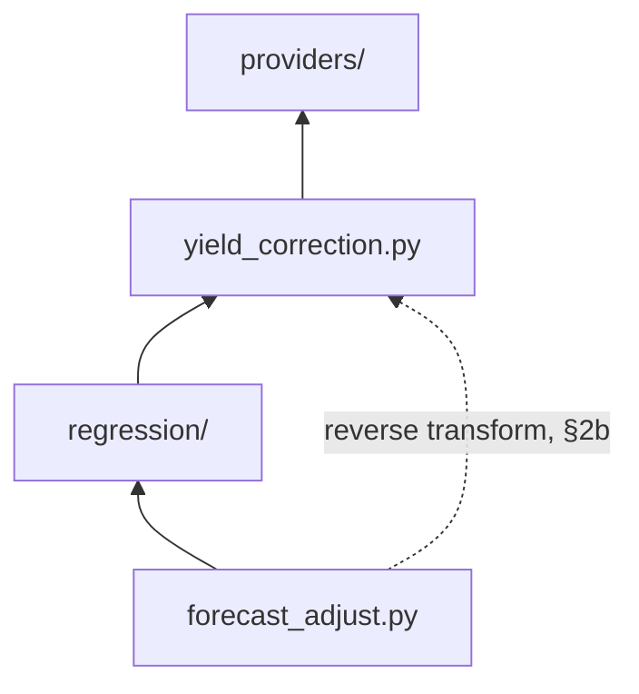

# ADR-003 – Optional Per-String Yield Corrections: Clipping and Derating

**Date:** 2026-07-04
**Status:** Accepted

---

## Context

ADR-001 infers shading purely from the gap between a string's baseline
forecast and its actual historical yield. Two real, common phenomena
produce a gap of the *same shape* for reasons that have nothing to do with
shading, and would otherwise be silently absorbed into the learned
shading factor as if they were shading:

- **Inverter clipping.** An inverter has a maximum AC output power. If the
  array's DC potential exceeds it (e.g. a 6 kWp array on a 5 kW inverter
  at high irradiance), actual yield flatlines at the inverter's limit
  regardless of how much more sunlight is available. This happens
  systematically around solar noon / high sun elevation.
- **Temperature derating.** PV module output falls as cell temperature
  rises above the 25 °C standard test condition, by a module-specific
  coefficient (typically on the order of −0.3 to −0.5 %/°C). This
  systematically lowers yield on hot days, independent of shading — and,
  critically, in the same summer months that ADR-001 §4's rolling window
  is already trying to track for a *different* reason (deciduous canopy
  density). Left unmodeled, temperature derating and canopy-density change
  would be conflated into one number, with no way to tell how much of a
  summer shading dip is the tree and how much is heat.

Neither of these is a Shady-specific novelty — both are well-known PV
phenomena — but they are **not already conceptualized in Effy**. Effy
solves a different problem (distributing an already-measured loss between
input and output sensors, ADR-001/005 there); it never compares a forecast
to an actual value and has no notion of clipping or temperature at all.
This ADR is Shady's own.

---

## Decision

Both corrections are optional, so neither adds friction for an
installation where it doesn't apply — surfaced through an advanced,
opt-in step in the config flow, since not every installation is clipped
or thermally exposed to the same degree. Their scope differs, though:
clipping (§1/§1a) is entirely **per-string** (an inverter limit is a
property of that specific string's hardware), while derating (§2/§2a/
§2b) is a **mix** — the temperature source default and the §2c
provider-already-corrects flag are global (one FC data provider per
config entry, §2c), the temperature coefficient and an optional
temperature-source override are per-string. This mirrors the same
global-vs-per-string split already established elsewhere (ADR-001 §2's
regression method and §3b's smoothing radius are global; ADR-001 §3's
models are per-string) rather than following one uniform rule for every
setting in this ADR.

### 1 — Clipping: exclude, don't downweight

If the user configures an **inverter AC power limit** for a string, any
historical sample whose actual yield is at or above a threshold fraction
of that limit (default 98%) is **excluded entirely** from that string's
training data — not downweighted, unlike the existing
`magnitude_weight_i` treatment of near-zero baseline samples (ADR-001
§2).

The distinction matters: a near-zero baseline sample is merely *noisy*
(the true ratio is still meaningful, just unreliable), whereas a clipped
sample is *censored* — the actual yield at that moment carries no
information about what the unshaded, unclipped yield would have been, in
either direction. Downweighting a censored sample still lets it pull the
fit slightly toward "no shading here", which is not something the data
actually supports; excluding it is the correct treatment of censored
data, not a stricter version of the same downweighting mechanism.

### 1a — The same limit also bounds the corrected output, not only the training data

Excluding clipped samples from training (§1) keeps the *fit itself*
honest, but says nothing about what happens at *prediction* time: a
fitted model — especially `wls2`/`wls3` with their curvature — can still
predict a corrected forecast above the inverter's physical ceiling for an
unusually high `FC` value, the same extrapolation failure mode ADR-001
§2 already demonstrates numerically. So when an inverter AC power limit
is configured for a string, it is applied as a **second, tighter upper
clamp** on top of ADR-001 §2's `[0, FC]` clamp — the corrected output is
clamped to `[0, min(FC, inverter_limit)]`. This costs nothing extra to
implement (it is the same clamp mechanism, just with a second bound) and
closes a gap that the training-time exclusion alone does not: excluding
clipped samples stops the model from *learning* the wrong shape, but only
the output clamp stops it from *predicting* past a limit it never saw
violated in training either.

### 2 — Derating: correct before the ratio is formed, not inside the model

If a temperature source is configured (see §2a) and a **temperature
coefficient** (%/°C, default −0.4, a typical crystalline-silicon value)
is set for a string, the actual yield sample is temperature-corrected to
its 25 °C-equivalent value *before* `ratio_i = actual_yield_i /
baseline_forecast_i` is computed:

```
actual_corrected = actual_raw / (1 + coefficient_per_c · (cell_temperature − 25))
```

This is a pre-processing step, not a regression concern — the regression
strategies in `regression/` (ADR-001 §2) never see raw, temperature-biased
samples in the first place, and have no knowledge that derating correction
happened at all. This keeps the learned shading factor meaning exactly one
thing (shading), rather than "shading plus whatever thermal effect wasn't
otherwise accounted for", and keeps `regression/` itself unaware of a
concern that belongs one layer below it.

### 2a — Temperature source: a hierarchy, not one fixed sensor type

A dedicated per-module/per-string temperature sensor is the most accurate
input to §2, but is uncommon — most installations have, at best, a single
ambient sensor for the whole property, or only whatever a weather
integration reports. Rather than requiring a module sensor, three source
types are supported, in order of accuracy:

| Source | Accuracy | How it's used |
|---|---|---|
| Per-string module/cell temperature sensor | Best — actual measured cell temperature | Used directly as `cell_temperature` in §2's formula |
| Global ambient temperature sensor (one sensor, shared across strings) | Good | Uplifted to an estimated cell temperature first (below) |
| Weather-integration current temperature (a `weather.*` entity's current condition, not its forecast) | Weakest, but still better than no correction at all | Same uplift as the ambient case |

Unlike the baseline-discovery heuristics in ADR-001 §5, no attribute-shape
scoring is needed here: Home Assistant's `device_class: temperature` on
`sensor.*` entities, and the `temperature` attribute on `weather.*`
entities, are stable, versioned conventions — a plain entity selector
filtered to those is sufficient, with no candidate-ranking step.

**Ambient → cell temperature uplift**, used whenever the configured source
is ambient or weather-based rather than a direct module reading:

```
cell_temperature ≈ ambient_temperature + max_uplift_c · (baseline_forecast_i / baseline_rated_capacity)
```

`baseline_forecast_i` at the same timestamp is reused as an irradiance
proxy — no separate irradiance sensor is required. At zero baseline
(dawn/dusk/night) the uplift is zero (module is at ambient temperature);
at full rated output, the uplift reaches its configurable maximum (default
`max_uplift_c = 25`, a common rule-of-thumb figure for module-over-ambient
temperature rise at full sun with light wind). This is a deliberately
simple approximation (no wind-speed term, unlike e.g. the Sandia/PVWatts
cell-temperature models) — accurate enough to catch the dominant "hot
summer midday" effect that motivates §2 in the first place, without
requiring a wind sensor most users won't have either.

The temperature *source* is configured **globally** (like the regression
method and smoothing radius, ADR-001 §2/§3b) — one default for the whole
integration — but can be **overridden per string** if a particular string
has its own module sensor (see §4). The temperature *coefficient* remains
per-string (§4 unchanged), since different strings can use different
module hardware with different thermal behavior even under the same
temperature source.

### 2b — Reversing the normalization at prediction time

**§2's correction alone is incomplete, and would silently introduce a
new, opposite bias if left as-is.** Training on 25 °C-equivalent samples
means the fitted model (`regression/`, ADR-001 §2) predicts `PV` *as it
would be at 25 °C* — not as it will actually be for a future slot at
whatever temperature actually occurs then. Left uncorrected, this
systematically **overpredicts on hot slots** (real cell temperature above
25 °C, so real output is below the 25 °C-equivalent the model outputs)
and **underpredicts on cold ones** — exactly the same kind of systematic
error §2 exists to remove, just reintroduced at the other end of the
pipeline. So after the model produces its prediction, that prediction
must be converted back using the *target slot's own expected*
temperature — the exact inverse of §2's forward transform:

```
predicted_actual = predicted_at_25c × (1 + coefficient_per_c · (target_cell_temperature − 25))
```

`target_cell_temperature` is computed the same way §2a already computes
`cell_temperature` for training (direct module reading, or the ambient →
cell uplift formula using `FC` as the irradiance proxy) — but evaluated
for the **slot being predicted**, not for a historical sample. This
matters because a prediction is inherently forward-looking (today's
remaining slots, or tomorrow, per ADR-002 §3): the temperature source
must supply an expected value for a point in time that has not happened
yet, not merely "right now".

This changes what §2a's temperature source needs to provide at
prediction time, specifically for the ambient/weather tier:

- **Weather-integration source**: use that entity's own `forecast`
  attribute (a genuine temperature forecast for a future hour) for the
  target slot's timestamp, rather than the "current condition" reading
  §2a otherwise specifies for building the training set. Most weather
  integrations expose both; §2a's restriction to current-condition-only
  is a training-time concern only — this is a separate, prediction-time-only
  use of the same configured entity.
- **Plain ambient or module sensor source** (no forecast capability):
  falls back to a naive persistence assumption — the most recently known
  reading is used as the expected temperature for every future slot being
  predicted, rather than leaving the reverse step unapplied. This is a
  real approximation with no claim to accuracy beyond "better than
  assuming exactly 25 °C for every future hour regardless of season or
  time of day" — a user who wants better accuracy here should point the
  temperature source at a forecast-capable `weather.*` entity for this
  purpose specifically, even if a more accurate module sensor is used for
  the training side in §2a.

Like §2's forward transform, this reverse step is a pre/post-processing
concern, not something `regression/` (ADR-001 §2) knows about — it is
applied by whatever calls the fitted model to produce a slot's prediction
(`forecast_adjust.py` or `coordinator.py`, not the model itself), mirroring
`yield_correction.py`'s existing role as a layer the regression strategies
are unaware of.

### 2c — Not every baseline provider needs this correction at all

§2/§2a/§2b implicitly assumed every baseline is a "raw" signal with no
temperature modeling of its own — true for a sunshine-duration- or
cloud-coverage-derived weather fallback alike (ADR-001 §5; neither proxy
has any notion of module temperature, only expected irradiance), but
**not** true for a dedicated PV-forecast service: Solcast, in particular,
already applies its own temperature-coefficient modeling internally
before publishing a forecast value.
Running §2/§2b's normalize-then-reverse correction on top of a baseline
that already accounts for temperature would double-count the effect —
correcting for temperature twice, once inside the provider's own number
and once inside Shady's — which is worse than not correcting for it at
all, not merely redundant.

**This is a single, global flag, not a per-string one** — "does the
configured baseline provider already account for temperature effects
itself?" A config entry has exactly one FC data provider in practice
(every configured string's baseline ultimately comes from the same
service, e.g. every string is a Solcast rooftop site, or every string is
Forecast.Solar), so there is exactly one answer to this question per
config entry, not one per string. When set, §2's forward normalization is
skipped during training for *every* configured string (actual-yield
samples are used as-is, not shifted to a 25 °C-equivalent) and §2b's
reverse transform is skipped at prediction time for all of them (each
model's raw output is used directly) — the temperature-source and
coefficient fields from §2a become irrelevant for every string, whether
or not they are otherwise configured. When unset (the default), the full
§2/§2a/§2b pipeline applies exactly as already specified, for every
string alike.

The default is simply `false` (assume the provider does *not* model
temperature, so Shady's own correction runs) — the conservative choice,
since silently skipping a needed correction (leaving a real confound
in place) is a smaller error than silently double-counting one. A user
who knows their specific provider already models temperature internally
(Solcast being the concrete example motivating this) sets the flag to
`true` explicitly; Shady has no reliable way to infer this on its own,
since ADR-001 §5 deliberately discovers baselines by attribute shape
rather than by which integration or service published them, and
attribute shape alone does not reveal whether temperature was already
factored in upstream.

**A per-string baseline override is temperature-aware by definition, no
separate per-string flag.** ADR-001 §5/§6 let an individual string
override the global default baseline candidate with its own (e.g. a
per-plane Solcast site for that string's specific orientation). Rather
than asking the same "does this provider model temperature?" question a
second time at the per-string level, a per-string override is simply
*assumed* temperature-aware — the realistic reason to configure one
per-string baseline at all is a dedicated PV-forecast service used
per-plane, which is exactly the category of provider this flag exists to
recognize. A string using the global default still follows that global
flag's value, whatever it is set to. This trades a small amount of
correctness (an override that happens to *not* be temperature-aware,
e.g. a per-string weather-based fallback, would incorrectly skip §2/§2b's
correction for that one string) for one fewer question in the common
case — see the Consequences below.

### 3 — Module: a new pre-processing layer, below `regression/`

Both corrections live in a new pure module, `yield_correction.py`. Unlike
`providers/` → `regression/`'s single upward flow, `yield_correction.py`
is now used at **two** points in the pipeline — once forward, preparing
training data, and once in reverse, finishing a prediction:



- **`providers/`** — baseline + actual-yield raw series.
- **`yield_correction.py`** — forward: excludes clipped samples per §1;
  normalizes actual-yield samples to 25°C per §2; no HA imports, tested
  with zero mocking like the rest of the pure layer, per ADR-000 §6.
- **`regression/`** — unchanged from ADR-001 — never sees a raw, clipped,
  or temperature-biased sample.
- **`forecast_adjust.py`** — calls back into `yield_correction.py`'s
  reverse transform per §2b (the dashed edge above) — converts a
  25°C-equivalent prediction back to the target slot's own expected
  temperature — then runs ADR-006's intraday deviation correction (§1)
  on that unclamped value, in whichever shape the currently-configured
  state calls for (a single ramped-and-clamped-ratio multiply under
  Ramping, ADR-006 §1a; two independently-computed sides crossfaded
  together under Blending, ADR-006 §1b; a no-op if disabled), and only
  then applies §1a's output clamp — once, last.

`yield_correction.py` itself stays a single, small, stateless module —
the forward and reverse functions are two entry points into the same
pure logic (one is exactly the algebraic inverse of the other), not two
separately-maintained implementations of the correction.

Both corrections are no-ops when not configured for a string (the
function returns the input series unchanged), so a string with no
inverter limit or temperature sensor configured behaves exactly as
specified in ADR-001, with zero overhead.

### 4 — Config flow: see ADR-001 §6

ADR-001 §6 is the single, authoritative config-flow specification —
including the fields this ADR introduces (default temperature source and
the §2c provider-temperature flag, both in the global "settings" step;
converter/inverter limit and temperature-source override/coefficient in
the per-string "add_string_advanced" step). This ADR does not duplicate
that listing; see ADR-001 §6 directly, and §2c above for the per-string
override rule specifically.

---

## Consequences

- **Pro:** Shading factors are no longer confounded with two well-known,
  unrelated PV phenomena — clipping and temperature derating — improving
  accuracy specifically in the conditions (high sun elevation, hot summer
  days) where both are common and would otherwise masquerade as shading.
- **Pro:** §2c's flag prevents a real, otherwise-silent failure mode:
  applying §2/§2b's temperature correction on top of a baseline (like
  Solcast) that already models temperature internally would double-count
  the effect, actively making the forecast worse than not correcting for
  temperature at all — worse than the confound §2/§2a/§2b exist to fix in
  the first place.
- **Pro:** Both corrections are fully optional and per-string, so
  installations without a clipping inverter or without a temperature
  sensor pay no config-flow cost and no runtime cost (no-op path, §3).
- **Pro:** Keeping corrections in a dedicated pre-processing module means
  `regression/` (ADR-001 §2) and its four strategies stay exactly as
  specified, with no special-casing for corrected vs. uncorrected samples.
- **Pro:** §1a's output clamp closes a gap that
  training-time exclusion alone cannot: it protects the corrected forecast
  itself from exceeding a known physical ceiling even when the fitted
  model — through ordinary extrapolation, not a bug — would otherwise
  predict past it.
- **Pro:** The temperature-source hierarchy (§2a) means derating
  correction is available even without a dedicated module sensor — the
  common case — using a global ambient or weather-provider reading plus
  the existing baseline series as an irradiance proxy, with no new sensor
  type required.
- **Pro:** §2b's reverse transform is the exact algebraic inverse of §2's
  forward one, implemented as two entry points into the same small
  module rather than separately — closes a real, otherwise-silent bias
  (systematic over/under-prediction by temperature) with no duplicated
  logic to keep in sync.
- **Con:** §2b's reverse transform needs a genuine *forecast* of
  temperature for the target slot, not merely a current reading — only
  available if the configured source is a `weather.*` entity exposing a
  forecast attribute. A plain ambient or module sensor falls back to
  persisting its latest known reading for every future slot, which is a
  materially cruder approximation the further ahead the prediction is
  (tomorrow's forecast persisting today's temperature is a weaker
  assumption than the next hour doing so) — a user who wants accurate
  derating correction specifically benefits from pointing the source at
  a forecast-capable entity, even if a more precise module sensor is
  configured for the training side.
- **Con:** Clipping exclusion (§1) reduces the number of usable samples
  for slots that regularly clip (typically midday, in summer) — precisely
  the slots that, for an unclipped installation, would otherwise have the
  most data. For an installation that clips often, this can noticeably
  slow how quickly midday slots reach useful confidence (ADR-001 §2).
- **Con:** The default clipping threshold (98%) and temperature
  coefficient (−0.4%/°C) are reasonable industry-typical defaults, not
  measured values for the user's specific hardware — a user who leaves
  them at default gets an approximation, not a precise correction.
  Accepted as a reasonable default for a feature that is itself optional.
- **Con:** These settings require the user to know their inverter's rated
  AC power and, if they want derating correction, to already have a
  module/ambient temperature sensor in Home Assistant — not universally
  available, hence the settings being optional rather than a blocking
  requirement.
- **Con:** The ambient → cell temperature uplift (§2a) is a deliberately
  simple approximation (no wind term, a fixed default maximum uplift) —
  it corrects the dominant effect (hot, sunny midday) but is less accurate
  than a real module sensor, and a weather-provider's current-temperature
  reading may itself lag or differ from the actual on-site ambient
  temperature.
- **Con:** §2c's default (`false`, "assume no built-in temperature
  modeling") is the conservative choice, but still requires the user to
  know their specific provider's behavior and flip it themselves when
  relevant (Solcast being the concrete example) — Shady has no way to
  verify this automatically, only to pick the safer of two possible wrong
  defaults.
- **Con:** §2c's global flag reflects the *default* FC data provider,
  which is no longer a hard "exactly one provider per config entry"
  limitation now that a string can override its baseline candidate
  (ADR-001 §5/§6) — mixing, say, a weather-based global default with one
  Solcast-sourced string is representable: the override is automatically
  treated as temperature-aware regardless of the global flag's value.
  The remaining gap is the *other* direction: a string that overrides
  its baseline with something that is deliberately **not**
  temperature-aware (e.g. a per-string weather-based fallback used
  alongside an otherwise-Solcast setup) has no way to say so — every
  override is assumed temperature-aware, per the rule in §2c, whether or
  not that happens to be true for it specifically.
