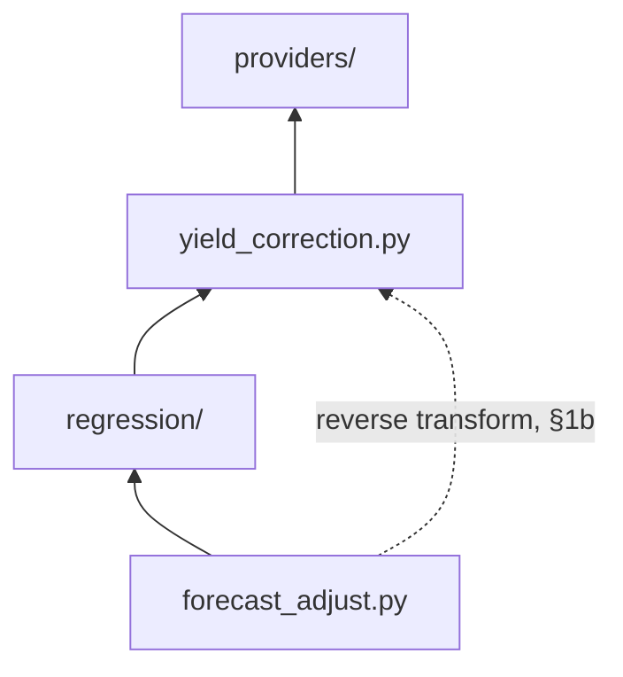

# ADR-003b – Optional Per-String Yield Correction: Temperature Derating

**Date:** 2026-08-18
**Status:** Accepted
**Split from:** ADR-003 (2026-07-04), §2/§2a/§2b/§2c, plus §3's
module-placement discussion, which this document retains as the
canonical description of `yield_correction.py`'s shared, two-role shape
(§2 below) since derating's forward/reverse round-trip is what gives the
module that shape in the first place. Originally combined with inverter
clipping exclusion in one document; separated because the two
corrections are independently optional, independently configured, and
share no decision-relevant logic beyond both living in
`yield_correction.py`. No behavior changed by this split — see ADR-003's
Revision note.
**Amended:** 2026-08-18 — §1a/§1b updated: the cell/ambient-tier
prediction-time fallback is no longer naive persistence, but a learned
per-slot forecast (ADR-003c), with the forward+reverse correction now
skipped together, not just the reverse half, when no forecast-capable
predictor is available. See ADR-003c for the full mechanism.
**2026-08-19** — §2's `forecast_adjust.py` bullet trimmed to point at
ADR-006 §1b for the clamp-ordering rationale instead of restating the
Ramping/Blending mechanics inline; no behavior changed.
**2026-08-20** — §1a: new paragraph states where `max_uplift_c` and
`baseline_rated_capacity` actually come from (ADR-010 config-flow
fields, one global and one per-string) and what happens when the
per-string one is left unset — previously used in the uplift formula
without either being specified anywhere.

---

## Context

ADR-001 infers shading purely from the gap between a string's baseline
forecast and its actual historical yield. **Temperature derating**
produces a gap of the same shape for a reason that has nothing to do
with shading, and would otherwise be silently absorbed into the learned
shading factor as if it were shading: PV module output falls as cell
temperature rises above the 25 °C standard test condition, by a
module-specific coefficient (typically on the order of −0.3 to −0.5
%/°C). This systematically lowers yield on hot days, independent of
shading — and, critically, in the same summer months that ADR-001 §4's
rolling window is already trying to track for a *different* reason
(deciduous canopy density). Left unmodeled, temperature derating and
canopy-density change would be conflated into one number, with no way to
tell how much of a summer shading dip is the tree and how much is heat.

This is not a Shady-specific novelty — it's a well-known PV phenomenon —
but it is not already conceptualized in Effy, for the same reason given
in ADR-003a's Context: Effy never compares a forecast to an actual value
and has no notion of temperature at all. This correction is Shady's own,
alongside inverter clipping exclusion (ADR-003a), with which it shares a
home in `yield_correction.py` but is otherwise independent.

---

## Decision

Derating correction is optional, so it adds no friction for an
installation with no way to measure temperature — surfaced through an
advanced, opt-in step in the config flow (ADR-010). Its scope is a mix
of global and per-string: the temperature source default and the §1c
provider-already-corrects flag are global (one FC data provider per
config entry in practice, §1c), while the temperature coefficient and an
optional temperature-source override are per-string. This mirrors the
same global-vs-per-string split already established elsewhere (ADR-001
§2's regression method and ADR-011 §1's smoothing radius are global;
ADR-003a's clipping threshold is global for the analogous reason) rather
than following one uniform rule.

### 1 — Correct before the ratio is formed, not inside the model

If a temperature source is configured (see §1a) and a **temperature
coefficient** (%/°C, default −0.4, a typical crystalline-silicon value)
is set for a string, the actual yield sample is temperature-corrected to
its 25 °C-equivalent value *before* `ratio_i = actual_yield_i /
baseline_forecast_i` is computed:

```
actual_corrected = actual_raw / (1 + coefficient_per_c · (cell_temperature − 25))
```

This is a pre-processing step, not a regression concern — the regression
strategies in `regression/` (ADR-001 §2) never see raw, temperature-biased
samples in the first place, and have no knowledge that derating correction
happened at all. This keeps the learned shading factor meaning exactly one
thing (shading), rather than "shading plus whatever thermal effect wasn't
otherwise accounted for", and keeps `regression/` itself unaware of a
concern that belongs one layer below it.

**This forward step does not run on its own for the module/cell-sensor
or ambient-sensor tiers.** For those two tiers (§1a), this correction
only applies if a weather forecast entity for temperature prediction is
also configured (ADR-003c §3) — without one, ADR-003c §5 skips this
forward normalization *and* §1b's reverse transform together, not just
the reverse half. A string on the weather-integration tier is
unaffected by this coupling, since that tier already forecasts natively
and never depends on ADR-003c's mechanism.

### 1a — Temperature source: a hierarchy, not one fixed sensor type

A dedicated per-module/per-string temperature sensor is the most accurate
input to §1, but is uncommon — most installations have, at best, a single
ambient sensor for the whole property, or only whatever a weather
integration reports. Rather than requiring a module sensor, three source
types are supported, in order of accuracy:

| Source | Accuracy | How it's used |
|---|---|---|
| Per-string module/cell temperature sensor | Best — actual measured cell temperature | Used directly as `cell_temperature` in §1's formula |
| Global ambient temperature sensor (one sensor, shared across strings) | Good | Uplifted to an estimated cell temperature first (below) |
| Weather-integration current temperature (a `weather.*` entity's current condition, not its forecast) | Weakest, but still better than no correction at all | Same uplift as the ambient case |

Unlike the baseline-discovery heuristics in ADR-009, no attribute-shape
scoring is needed here: Home Assistant's `device_class: temperature` on
`sensor.*` entities, and the `temperature` attribute on `weather.*`
entities, are stable, versioned conventions — a plain entity selector
filtered to those is sufficient, with no candidate-ranking step. *(How
this source is actually resolved and fetched at runtime — a second
concrete provider alongside baseline discovery, reusing `cache.py`
unchanged — is specified in ADR-012, which is the source of truth for
that connective architecture; this section stays scoped to which sources
are supported and the formulas below. How the module/cell and ambient
tiers obtain a genuine forecast rather than a live reading is specified
in ADR-003c — see §1b below.)*

**Ambient → cell temperature uplift**, used whenever the configured source
is ambient or weather-based rather than a direct module reading:

```
cell_temperature ≈ ambient_temperature + max_uplift_c · (baseline_forecast_i / baseline_rated_capacity)
```

`baseline_forecast_i` at the same timestamp is reused as an irradiance
proxy — no separate irradiance sensor is required. At zero baseline
(dawn/dusk/night) the uplift is zero (module is at ambient temperature);
at full rated output, the uplift reaches its configurable maximum (default
`max_uplift_c = 25`, a common rule-of-thumb figure for module-over-ambient
temperature rise at full sun with light wind). This is a deliberately
simple approximation (no wind-speed term, unlike e.g. the Sandia/PVWatts
cell-temperature models) — accurate enough to catch the dominant "hot
summer midday" effect that motivates §1 in the first place, without
requiring a wind sensor most users won't have either.

**Where these two figures come from.** `max_uplift_c` is a single
**global** config-flow field (ADR-010's "settings" step, default `25`) —
one property-wide rule-of-thumb, not tuned per string, the same global
scope this section's own temperature-source default already has below.
`baseline_rated_capacity`, by contrast, is a genuine per-string physical
property (a 6 kWp string and a 3 kWp string heat differently under the
same irradiance) and is a **per-string** field in ADR-010's
`add_string_advanced` step ("Rated DC capacity, Wp") — shown and used
only for a string actually resolving to this tier, since a module/cell-
sensor string reads cell temperature directly and never evaluates this
formula at all (§1a's source hierarchy). Left empty for a string that
does need it, this uplift step — and, with it, §1's forward correction
and §1b's reverse transform in their entirety — is skipped for that
string: the same "skip both sides rather than degrade one" rule §1c
already applies to the provider-temperature flag, and ADR-003c §5
applies to a missing forecast-capable predictor, applied here to a
missing rated-capacity input instead of a missing forecast. Falling back
to an assumed capacity instead would risk silently misleading more than
skipping the correction entirely.

The temperature *source* is configured **globally** (like the regression
method, ADR-001 §2, and smoothing radius, ADR-011 §1) — one default for
the whole integration — but can be **overridden per string** if a
particular string has its own module sensor (see §3). The temperature
*coefficient* remains per-string (§3 unchanged), since different strings
can use different module hardware with different thermal behavior even
under the same temperature source.

### 1b — Reversing the normalization at prediction time

**§1's correction alone is incomplete, and would silently introduce a
new, opposite bias if left as-is.** Training on 25 °C-equivalent samples
means the fitted model (`regression/`, ADR-001 §2) predicts `PV` *as it
would be at 25 °C* — not as it will actually be for a future slot at
whatever temperature actually occurs then. Left uncorrected, this
systematically **overpredicts on hot slots** (real cell temperature above
25 °C, so real output is below the 25 °C-equivalent the model outputs)
and **underpredicts on cold ones** — exactly the same kind of systematic
error §1 exists to remove, just reintroduced at the other end of the
pipeline. So after the model produces its prediction, that prediction
must be converted back using the *target slot's own expected*
temperature — the exact inverse of §1's forward transform:

```
predicted_actual = predicted_at_25c × (1 + coefficient_per_c · (target_cell_temperature − 25))
```

`target_cell_temperature` is computed the same way §1a already computes
`cell_temperature` for training (direct module reading, or the ambient →
cell uplift formula using `FC` as the irradiance proxy) — but evaluated
for the **slot being predicted**, not for a historical sample. This
matters because a prediction is inherently forward-looking (today's
remaining slots, or tomorrow, per ADR-002 §3): the temperature source
must supply an expected value for a point in time that has not happened
yet, not merely "right now".

This changes what §1a's temperature source needs to provide at
prediction time, specifically for the ambient/weather tier:

- **Weather-integration source**: use that entity's own `forecast`
  attribute (a genuine temperature forecast for a future hour) for the
  target slot's timestamp, rather than the "current condition" reading
  §1a otherwise specifies for building the training set. Most weather
  integrations expose both; §1a's restriction to current-condition-only
  is a training-time concern only — this is a separate, prediction-time-only
  use of the same configured entity.
- **Module/cell sensor or ambient sensor source** (no forecast
  capability of their own): ADR-003c specifies a learned per-slot model
  that forecasts this tier's expected reading from a weather entity's
  own temperature forecast — reusing the same slot-partitioned,
  rolling-window machinery ADR-001 already applies to the shading model
  itself. If no forecast-capable weather entity is available to train
  that model against, this correction — both this forward step and this
  reverse step — is skipped entirely for the string in question, rather
  than falling back to a cruder approximation; see ADR-003c §5 for why a
  training-time-only correction with no matching reversal is worse than
  no correction at all.

Like §1's forward transform, this reverse step is a pre/post-processing
concern, not something `regression/` (ADR-001 §2) knows about — it is
applied by whatever calls the fitted model to produce a slot's prediction
(`forecast_adjust.py` or `coordinator.py`, not the model itself), mirroring
`yield_correction.py`'s existing role as a layer the regression strategies
are unaware of.

### 1c — Not every baseline provider needs this correction at all

§1/§1a/§1b implicitly assumed every baseline is a "raw" signal with no
temperature modeling of its own — true for a sunshine-duration- or
cloud-coverage-derived weather fallback alike (ADR-009; neither proxy
has any notion of module temperature, only expected irradiance), but
**not** true for a dedicated PV-forecast service: Solcast, in particular,
already applies its own temperature-coefficient modeling internally
before publishing a forecast value.
Running §1/§1b's normalize-then-reverse correction on top of a baseline
that already accounts for temperature would double-count the effect —
correcting for temperature twice, once inside the provider's own number
and once inside Shady's — which is worse than not correcting for it at
all, not merely redundant.

**This is a single, global flag, not a per-string one** — "does the
configured baseline provider already account for temperature effects
itself?" A config entry has exactly one FC data provider in practice
(every configured string's baseline ultimately comes from the same
service, e.g. every string is a Solcast rooftop site, or every string is
Forecast.Solar), so there is exactly one answer to this question per
config entry, not one per string. When set, §1's forward normalization is
skipped during training for *every* configured string (actual-yield
samples are used as-is, not shifted to a 25 °C-equivalent) and §1b's
reverse transform is skipped at prediction time for all of them (each
model's raw output is used directly) — the temperature-source and
coefficient fields from §1a become irrelevant for every string, whether
or not they are otherwise configured. When unset (the default), the full
§1/§1a/§1b pipeline applies exactly as already specified, for every
string alike.

The default is simply `false` (assume the provider does *not* model
temperature, so Shady's own correction runs) — the conservative choice,
since silently skipping a needed correction (leaving a real confound
in place) is a smaller error than silently double-counting one. A user
who knows their specific provider already models temperature internally
(Solcast being the concrete example motivating this) sets the flag to
`true` explicitly; Shady has no reliable way to infer this on its own,
since ADR-009 deliberately discovers baselines by attribute shape
rather than by which integration or service published them, and
attribute shape alone does not reveal whether temperature was already
factored in upstream.

**A per-string baseline override is temperature-aware by definition, no
separate per-string flag.** ADR-009/ADR-010 let an individual string
override the global default baseline candidate with its own (e.g. a
per-plane Solcast site for that string's specific orientation). Rather
than asking the same "does this provider model temperature?" question a
second time at the per-string level, a per-string override is simply
*assumed* temperature-aware — the realistic reason to configure one
per-string baseline at all is a dedicated PV-forecast service used
per-plane, which is exactly the category of provider this flag exists to
recognize. A string using the global default still follows that global
flag's value, whatever it is set to. This trades a small amount of
correctness (an override that happens to *not* be temperature-aware,
e.g. a per-string weather-based fallback, would incorrectly skip
§1/§1b's correction for that one string) for one fewer question in the
common case — see the Consequences below.

### 2 — Module: a new pre-processing layer, below `regression/`

Both of `yield_correction.py`'s corrections — this one and clipping
exclusion (ADR-003a) — live in a new pure module. Unlike `providers/` →
`regression/`'s single upward flow, `yield_correction.py` is now used at
**two** points in the pipeline — once forward, preparing training data,
and once in reverse, finishing a prediction. *(Zoomed-in view of this
one module's own edges, including the reverse one — see ADR-000 §3 for
the full, current module graph.)*



- **`providers/`** — baseline series (discovery + normalize, ADR-009)
  and, per ADR-012, temperature series when the configured source needs
  one (§1a). Actual-yield is read directly by `coordinator.py` via
  `cache.py`'s `fetch_fn`, using the plain, user-selected entity_id
  (ADR-010) — no provider layer, since there is nothing to identify or
  normalize (ADR-012 §2).
- **`yield_correction.py`** — forward: excludes clipped samples per
  ADR-003a §1; normalizes actual-yield samples to 25°C per §1; no HA
  imports, tested with zero mocking like the rest of the pure layer, per
  ADR-000 §6.
- **`regression/`** — unchanged from ADR-001 — never sees a raw, clipped,
  or temperature-biased sample.
- **`forecast_adjust.py`** — calls back into `yield_correction.py`'s
  reverse transform per §1b (the dashed edge above) — converts a
  25°C-equivalent prediction back to the target slot's own expected
  temperature — then runs ADR-006's intraday deviation correction on
  that unclamped value, and only then applies ADR-003a §1a's output
  clamp, once, last. See ADR-006 §1b for the canonical statement of why
  this ordering — and not, say, clamping before the intraday
  correction — is the one that's correct; not restated here.

`yield_correction.py` itself stays a single, small, stateless module —
the forward and reverse functions are two entry points into the same
pure logic (one is exactly the algebraic inverse of the other), not two
separately-maintained implementations of the correction. `regression/`
is used a second time here, independently of its shading-model role
above: ADR-003c's learned per-slot temperature forecast (for the
cell/ambient tiers only) reuses the same fitting strategies for a
different pair of series — see ADR-003c §2 for that second use, not
reflected as a separate node in the diagram above since it reuses
`regression/` as-is rather than adding a module.

Derating is a no-op when not configured for a string (the function
returns the input series unchanged), so a string with no temperature
sensor configured behaves exactly as specified in ADR-001, with zero
overhead — the same "no-op when not configured" pattern ADR-004 §1 also
follows for its own optional feature, and ADR-003a §2 follows for
clipping.

### 3 — Config flow: see ADR-010

ADR-010 is the single, authoritative config-flow specification —
including the fields this document introduces (default temperature
source and the §1c provider-temperature flag, both in the global
"settings" step; temperature-source override/coefficient in the
per-string "add_string_advanced" step). This document does not duplicate
that listing; see ADR-010 directly, and §1c above for the per-string
override rule specifically.

---

## Consequences

- **Pro:** Shading factors are no longer confounded with temperature
  derating, improving accuracy specifically on hot summer days, when
  derating is most pronounced and would otherwise masquerade as a
  shading change.
- **Pro:** §1c's flag prevents a real, otherwise-silent failure mode:
  applying §1/§1b's temperature correction on top of a baseline (like
  Solcast) that already models temperature internally would double-count
  the effect, actively making the forecast worse than not correcting for
  temperature at all — worse than the confound §1/§1a/§1b exist to fix in
  the first place.
- **Pro:** Fully optional and per-string, so installations without a
  temperature sensor pay no config-flow cost and no runtime cost (no-op
  path, §2).
- **Pro:** Keeping this correction in a dedicated pre-processing module
  means `regression/` (ADR-001 §2) and its four strategies stay exactly
  as specified, with no special-casing for corrected vs. uncorrected
  samples.
- **Pro:** The temperature-source hierarchy (§1a) means derating
  correction is available even without a dedicated module sensor — the
  common case — using a global ambient or weather-provider reading plus
  the existing baseline series as an irradiance proxy, with no new
  sensor type required.
- **Pro:** §1b's reverse transform is the exact algebraic inverse of
  §1's forward one, implemented as two entry points into the same small
  module rather than separately — closes a real, otherwise-silent bias
  (systematic over/under-prediction by temperature) with no duplicated
  logic to keep in sync.
- **Con:** §1b's reverse transform needs a genuine *forecast* of
  temperature for the target slot, not merely a current reading. For the
  weather-integration tier this is native; for the cell/ambient tiers,
  ADR-003c's learned model supplies it when a forecast-capable weather
  entity is available anywhere in the configuration, and the correction
  is skipped entirely (not degraded) when one is not — see ADR-003c §5
  for the trade-off this represents.
- **Con:** The default temperature coefficient (−0.4%/°C) is a
  reasonable industry-typical default, not a measured value for the
  user's specific hardware — a user who leaves it at default gets an
  approximation, not a precise correction. Accepted as reasonable for a
  feature that is itself optional.
- **Con:** This correction requires the user to already have a
  module/ambient temperature sensor in Home Assistant, or a
  weather integration — not universally available, hence the setting
  being optional rather than a blocking requirement.
- **Con:** The ambient/weather tier additionally requires the user to
  know their string's rated DC capacity (§1a) — one more piece of
  hardware knowledge alongside the temperature coefficient (§1), though,
  like every other optional field in this correction, it defaults to
  being skipped rather than blocking configuration when left unset.
- **Con:** The ambient → cell temperature uplift (§1a) is a deliberately
  simple approximation (no wind term, a fixed default maximum uplift) —
  it corrects the dominant effect (hot, sunny midday) but is less
  accurate than a real module sensor, and a weather-provider's
  current-temperature reading may itself lag or differ from the actual
  on-site ambient temperature.
- **Con:** §1c's default (`false`, "assume no built-in temperature
  modeling") is the conservative choice, but still requires the user to
  know their specific provider's behavior and flip it themselves when
  relevant (Solcast being the concrete example) — Shady has no way to
  verify this automatically, only to pick the safer of two possible
  wrong defaults.
- **Con:** §1c's global flag reflects the *default* FC data provider,
  which is no longer a hard "exactly one provider per config entry"
  limitation now that a string can override its baseline candidate
  (ADR-009/ADR-010) — mixing, say, a weather-based global default with
  one Solcast-sourced string is representable: the override is
  automatically treated as temperature-aware regardless of the global
  flag's value. The remaining gap is the *other* direction: a string
  that overrides its baseline with something that is deliberately
  **not** temperature-aware (e.g. a per-string weather-based fallback
  used alongside an otherwise-Solcast setup) has no way to say so —
  every override is assumed temperature-aware, per the rule in §1c,
  whether or not that happens to be true for it specifically.
