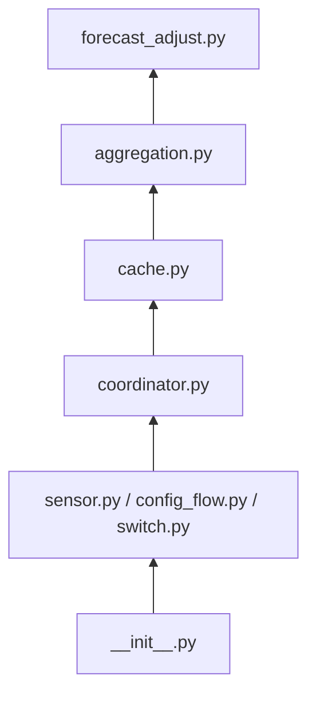

# ADR-007 – Splitting the Coordinator: A Dedicated Cache Module

**Date:** 2026-07-05
**Status:** Accepted
**Amended:** 2026-08-13 — §1e revised: `get_slot_pool` removed (no
remaining caller — see ADR-008 §2, which added a dedicated batched
accessor for the full sweep, while diagnostics already had its own
accessor in §1f). §1e and §1f reworded accordingly; no other behavior
changes.
**2026-08-19** — split: `cache.py`'s storage scheme and accessor design
(formerly §1a–§1f) moved out to ADR-007a — see the Revision note at the
end of this document.

---

## Context

Across ADR-002 through ADR-006, `coordinator.py` has accumulated two
kinds of responsibility that are conceptually unrelated, even though each
individual addition was a reasonable, small extension at the time:

**Scheduling/triggers** (four, independent):
- Daily recalibration, midnight or button (ADR-002 §1)
- Baseline-update listeners, triggering forecast recompute (ADR-002 §2)
- Midnight energy-integral reset (ADR-005 §5/§6)
- 5-minute recorder-poll, for the intraday-correction window (ADR-006
  §1a) — since reused by the diagnostics feature (ADR-004 §2) to advance
  which slot is diagnosed

**Retained state/cache** (five, independent):
- Per-string, per-slot fitted-model cache (ADR-002 §1)
- Per-string whole-day snapshot array, past slots frozen once elapsed
  (ADR-002 §3)
- Two persisted running totals for the energy-integral sensors (ADR-005
  §5/§6) — the one cache here that genuinely must survive a restart
  intact, unlike the others below
- Short-lived per-string ramp/crossfade state, discarded once a ramp or
  blend completes (ADR-006 §1b)
- Historical two-series pool cache, generic over any pair of
  `sensor_id`s, refreshed at recalibration/system-start — backs both
  regression training (ADR-001 §3a, ADR-011) and diagnostics (ADR-004
  §3). **Not per-string storage**: the cache is flat, keyed by
  `sensor_id` alone (§1a below) — it has no notion of "string" at all,
  and no built-in FC/PV pairing. `PV` (actual yield) genuinely is
  distinct per string, but `FC` (baseline forecast) very often is not:
  most strings use the same global default baseline candidate (ADR-009
  §5), so their `FC` history is the *same* `sensor_id`, stored and
  fetched exactly once regardless of how many strings reference it —
  only a string that explicitly overrides its baseline gets a distinct
  `FC` entry. Which `sensor_id` is a given string's `FC` and which is
  its `PV` is a mapping `coordinator.py` holds (from each string's
  config), not something this cache represents. Per ADR-003c, the same
  mechanism (not the same stored data, and not the same pairing
  concept) also backs a second, unrelated pair — `(weather-forecast
  temperature, cell-or-ambient temperature)` — for the learned
  temperature forecast, where the predictor side is *global* (ADR-003c
  §3) and only the target side varies by string.

This is exactly the situation ADR-000 §3 already warns about: "a module
that starts doing two unrelated things is a signal to split it." It also
has a concrete testing cost — `coordinator.py` is the one module in the
design that legitimately needs `hass` (for scheduling APIs, recorder
access, and pushing to entities), so every one of the five caches above
currently can only be tested through that same HA-dependent surface, even
though most of them are, in isolation, plain data-structure logic (get,
set, evict) with nothing HA-specific about their own correctness.

---

## Decision

### 1 — A new `cache.py`: owns all retained state, stays pure

`cache.py` holds the five caches listed above. It has **no `hass`
import** and is tested with zero mocking, exactly like `providers/`,
`regression/`, `aggregation.py`, and `yield_correction.py` (ADR-000 §6) —
this was the whole point of the split: cache correctness (does an
eviction actually clear the right entry, does a lookup for a
not-yet-populated slot behave sensibly) is now a pure-logic question, not
one that requires a fake `hass` to exercise. The concrete storage scheme
and accessor API this enables — including which two of the five caches
share one time-series design and which stay simple `dict[key, value]`
structures — are specified in ADR-007a, not here: this document covers
only *that* `cache.py` exists, what it owns, and how it relates to
`coordinator.py`.

**Not every cache needs restart-persistence, and `cache.py` does not
decide that on its own.** The energy-integral running totals (ADR-005
§5/§6) must survive a restart with their exact accumulated value intact —
losing that mid-day would visibly wrong-foot the sensor. The other four
caches are all safely rebuildable (the model cache and diagnostic pool
refill at the next recalibration; the day-snapshot array progressively
re-populates as slots are recomputed; the ramp state is short-lived by
design and losing it just means a ramp restarts instead of resuming, a
cosmetic gap at most) — treating them as restart-persisted too would be
needless complexity for no real benefit. `cache.py` itself is agnostic to
this distinction; `coordinator.py` decides, per cache, whether to wire it
to Home Assistant's restore-state mechanism on top of `cache.py`'s plain
in-memory interface — only the integral totals are wired that way.

### 2 — `coordinator.py` shrinks to pure orchestration

With state ownership moved out, `coordinator.py`'s remaining job is
exactly: register the four triggers from the Context above, and — on
each one firing — call into `regression/`, `yield_correction.py`,
`aggregation.py`, and `cache.py` as needed, then push results to
sensors. **`cache.py` is only ever called from `coordinator.py`** — no
other module reaches into it directly, the same "one orchestrator"
principle already applied to fix ADR-005's module diagram in an earlier
review of this design. This makes `coordinator.py` itself easier to read
top-to-bottom as "when X happens, do Y", without needing to also hold in
mind five different caches' internal shapes while doing so.

### 3 — Updated module diagram

Picking up from `regression/` in ADR-000 §3's full diagram: `providers/`
and `regression/` are unchanged and omitted below. `yield_correction.py`
is also omitted here — not because it is unchanged (ADR-003b §2 gave it a
second, reverse edge from `forecast_adjust.py`, reflected in ADR-000 §3's
diagram), but because nothing in *this* ADR touches it; see ADR-000 §3 or
ADR-003b §2 for `yield_correction.py`'s own up-to-date diagram, including
that reverse edge from `forecast_adjust.py` below.

- **`forecast_adjust.py`** — per-string corrected forecast, unchanged.
- **`aggregation.py`** — pure logic: cross-string sums, energy-increment
  calculation, accuracy calculation; see ADR-005/ADR-004.
- **`cache.py`** — pure logic: index-addressable time-series store —
  ADR-007a §1-§5 — for FC/PV history and the day-snapshot array, plus
  simple dict stores for the model cache and ramp state, and the two
  persisted integral totals; no HA imports; constructed with an injected
  `fetch_fn` so it never imports the recorder API itself; see ADR-007a
  §4 for the storage design, this document for why the module exists.
- **`coordinator.py`** — HA-facing: registers all four triggers, calls
  the pure layer including `cache.py`, decides which cache instances get
  restart-persisted, pushes results to sensors — the only module that
  imports `cache.py`.
- **`sensor.py` / `config_flow.py` / `switch.py`** — HA entity glue.
  (`button.py` is omitted from this node's label — unchanged by this
  ADR, not removed; see ADR-000 §3 or ADR-002 §1 for it.)
- **`__init__.py`** — wires platforms + coordinator into `hass.data`.

This slots in exactly where `coordinator.py` already sat in the overall
diagram (ADR-000 §3) — nothing downstream of `coordinator.py` changes,
only what sits directly beneath it.

---

## Consequences

- **Pro:** Cache correctness (eviction, lookup-miss behavior, shape of
  each stored value) becomes testable with zero mocking, the same benefit
  every other pure module in this design already has — previously this
  logic was only reachable through `coordinator.py`'s HA-dependent
  surface.
- **Pro:** `coordinator.py` itself becomes substantially easier to read
  and reason about — its job is now legible as "register four triggers,
  call the pure layer, push to sensors", not a mix of scheduling code and
  five different caches' bookkeeping interleaved.
- **Pro:** Matches the existing pure-logic/HA-glue module boundary
  (ADR-000 §3) instead of introducing a third category that's neither.
- **Con:** One more file to navigate for a project of this size — for a
  simpler integration with only one or two caches this split might be
  premature; it is justified here specifically because five independent
  caches and four independent triggers had already accumulated in one
  module.
- **Con:** The restart-persistence asymmetry (only the integral totals
  are wired to survive a restart intact) means `cache.py`'s interface
  cannot be perfectly uniform — `coordinator.py` needs slightly different
  wiring per cache instance rather than treating all five identically,
  a small amount of irregularity traded for not persisting state that
  doesn't need it.

See ADR-007a's own Consequences for the storage-scheme and accessor
trade-offs (index-addressable design, the three-state value model,
`fetch_fn` injection, the two-accessor-shape trade-off).

## Revision note

**2026-08-19 split:** this ADR originally also specified `cache.py`'s
concrete storage scheme and accessor API (formerly §1a–§1f). That
content was extracted into ADR-007a because it is a separable, and
independently heavily cross-referenced, concern from the *decision to
extract `cache.py` as its own module* in the first place — nearly every
later ADR that cites this document (001, 002, 003c, 004, 005, 006, 008,
009, 011, 012) was actually pointing at one of §1a–§1f's specific
subsections rather than this document's own split rationale, and ADR-008
§2 had already added a third accessor to the same family from outside
this document, meaning the accessor design was already living across two
documents in practice rather than one. This was a pure documentation
reorganization: no decision, default, or behavior changed. All
cross-references throughout the ADR set were updated to point at
ADR-007a directly.
