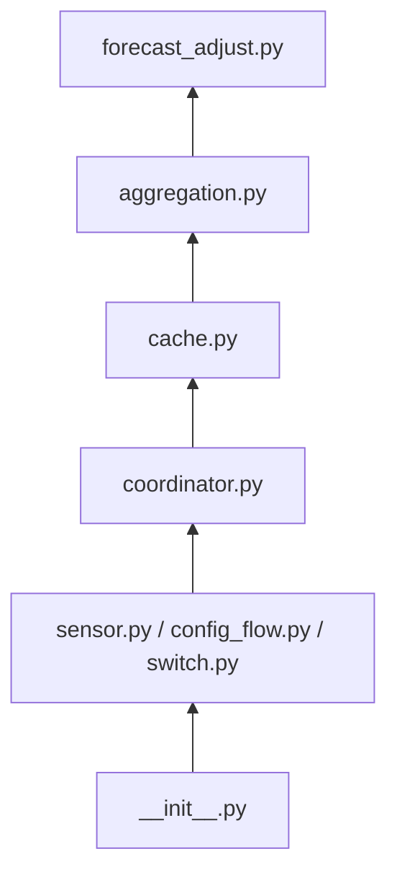

# ADR-007 – Splitting the Coordinator: A Dedicated Cache Module

**Date:** 2026-07-05
**Status:** Accepted

---

## Context

Across ADR-002 through ADR-006, `coordinator.py` has accumulated two
kinds of responsibility that are conceptually unrelated, even though each
individual addition was a reasonable, small extension at the time:

**Scheduling/triggers** (four, independent):
- Daily recalibration, midnight or button (ADR-002 §1)
- Baseline-update listeners, triggering forecast recompute (ADR-002 §2)
- Midnight energy-integral reset (ADR-005 §5/§6)
- 5-minute recorder-poll, for the intraday-correction window (ADR-006
  §1) — since reused by the diagnostics feature (ADR-004 §2) to advance
  which slot is diagnosed

**Retained state/cache** (five, independent):
- Per-string, per-slot fitted-model cache (ADR-002 §1)
- Per-string whole-day snapshot array, past slots frozen once elapsed
  (ADR-002 §3)
- Two persisted running totals for the energy-integral sensors (ADR-005
  §5/§6) — the one cache here that genuinely must survive a restart
  intact, unlike the others below
- Short-lived per-string ramp state, discarded once a ramp completes
  (ADR-006 §1a)
- Per-string historical `(FC, PV)` pool cache, refreshed at
  recalibration/system-start — backs both regression training (ADR-001
  §3a/§3b) and diagnostics (ADR-004 §3), the two consumers that read the
  same underlying slot-indexed history rather than each keeping its own
  copy

This is exactly the situation ADR-000 §3 already warns about: "a module
that starts doing two unrelated things is a signal to split it." It also
has a concrete testing cost — `coordinator.py` is the one module in the
design that legitimately needs `hass` (for scheduling APIs, recorder
access, and pushing to entities), so every one of the five caches above
currently can only be tested through that same HA-dependent surface, even
though most of them are, in isolation, plain data-structure logic (get,
set, evict) with nothing HA-specific about their own correctness.

---

## Decision

### 1 — A new `cache.py`: owns all retained state, stays pure

`cache.py` holds the five caches listed above. It has **no `hass`
import** and is tested with zero mocking, exactly like `providers/`,
`regression/`, `aggregation.py`, and `yield_correction.py` (ADR-000 §6) —
this was the whole point of the split: cache correctness (does an
eviction actually clear the right entry, does a lookup for a
not-yet-populated slot behave sensibly) is now a pure-logic question, not
one that requires a fake `hass` to exercise.

Two of the five are genuinely the same *shape* of thing — a 5-minute-
resolution time series per sensor, over a rolling window: the raw `FC`/
`PV` history backing both regression training (ADR-001 §3a/§3b) and
diagnostics (ADR-004 §3), and the day-snapshot corrected-forecast array
(ADR-002 §3). §1a–§1e give this one shared, index-addressable design
rather than bespoke handling per cache. The other two — the fitted-model
cache (objects, not floats) and the short-lived ramp state (ADR-006
§1a) — stay simple `dict[key, value]` structures without that machinery;
see the end of §1e for why they do not need it. The integral running
totals (ADR-005 §5/§6) are simpler still — one persisted scalar each.

`cache.py` is constructed with `window_days: int` (the global setting
from ADR-001 §4/§6) as a **setup parameter**, alongside `fetch_fn` (§1d)
— not re-supplied on every call. `window_days` is one value for the
whole cache instance, exactly like the global config-flow setting it
mirrors; sizing the per-sensor lists (§1a) and resolving a slot pool's
default window (§1e) both read this one stored value rather than each
call site passing its own copy of a number that never actually varies
between calls.

**Not every cache needs restart-persistence, and `cache.py` does not
decide that on its own.** The energy-integral running totals (ADR-005
§5/§6) must survive a restart with their exact accumulated value intact —
losing that mid-day would visibly wrong-foot the sensor. The other four
caches are all safely rebuildable (the model cache and diagnostic pool
refill at the next recalibration; the day-snapshot array progressively
re-populates as slots are recomputed; the ramp state is short-lived by
design and losing it just means a ramp restarts instead of resuming, a
cosmetic gap at most) — treating them as restart-persisted too would be
needless complexity for no real benefit. `cache.py` itself is agnostic to
this distinction; `coordinator.py` decides, per cache, whether to wire it
to Home Assistant's restore-state mechanism on top of `cache.py`'s plain
in-memory interface — only the integral totals are wired that way.

### 1a — Time-series storage: index-addressable, three-state values

```
values: dict[sensor_id: str, list[float | None | str]]
```

One list per sensor-id (an entity_id, or a Shady-internal series
identifier for something like the day-snapshot array), each entry
meaning:

- `float` — a known, valid value.
- `None` — not yet fetched, or explicitly invalidated; must be
  (re-)queried before use.
- `str` — a known, *stable* non-numeric outcome (e.g. `"unavailable"`):
  the recorder was asked and gave a definite, unusable answer. This is
  still a valid cache entry — querying again would return the same
  non-answer — it just is not a number a consumer can compute with.
  Distinguishing this from `None` avoids repeatedly re-querying an entity
  that is known to have no data for a given slot.

**Index = position in the rolling window, not a raw timestamp.** For a
28-day window at 5-minute resolution, that is `28 × 288 = 8064` entries
per sensor — small enough (a plain Python list of that size is a few
hundred KB even for several sensors at once) that a straightforward
implementation is preferable to a more compact but less flexible one:
`array.array('d', ...)` would pack floats tightly but cannot hold the
`None`/`str` states this design needs, so a plain `list` is used despite
the larger per-element overhead — correctness of the three-state model
matters more here than shaving a few hundred KB. The window size tracks
`window_days` from ADR-001 §4 (default 28) times 288, so it resizes if a
user changes the training window.

Indices are **absolute and monotonically increasing** from a single fixed
epoch (`index = (timestamp - epoch) // 5min`), not re-based to `0` at
every rollover — a second, small map tracks where each sensor's list
currently starts:

```
list_offset: dict[sensor_id: str, int]   # absolute index of list[0]
```

**Trimming is one explicit call, not an implicit side effect of writes.**
`cache.trim()` drops each sensor's oldest entries once its window has
rolled forward, advancing `list_offset` without needing to touch every
other piece of state that refers to an absolute index — in particular,
the validated ranges in §1b stay meaningful across a trim without
rewriting. `coordinator.py` calls `cache.trim()` exactly once, at the
ADR-002 §1 recalibration trigger (midnight or button) — never as a side
effect of the 5-minute tick (ADR-006 §1) or a baseline update (ADR-002
§2). This matters beyond tidiness once §1f's pinned reference date
exists: trimming needs to check whether it is currently set before
discarding anything older than the live window, and tying that check to
one explicit, predictable call — rather than letting it happen
implicitly on whichever trigger's write is next — is what makes that
check a guarantee instead of a race. See §1f for exactly how the
retained floor is computed.

### 1b — Validated range tracking

```
validated: dict[sensor_id: str, tuple[int, int | None]]
```

`(from_index, to_index)` — the absolute-index range currently known to be
up to date for that sensor. `to_index = None` has a specific meaning:
this sensor's values are **calculated by Shady and actively pushed**
(e.g. `ShadyForecastSensor`'s own corrected values, ADR-002 §2), so there
is no fixed upper edge to track — new values arrive by push (§1c), not by
query, and are always current the moment they're written. Only sensors
sourced from *outside* Shady (raw actual-yield, raw `FC` history) have a
concrete `to_index` bounded by "the last slot known to be complete" —
these are the ones the validation function (§1d) may need to query
forward for.

### 1c — Writing: push (by Shady) and invalidate (by anyone)

`coordinator.py` (the only caller of `cache.py`, per §2) can:

- **Push** a calculated value directly into a sensor's list at a given
  index, extending `validated`'s `to_index` for `to_index = None`
  sensors — this is how `ShadyForecastSensor`'s own output ends up in the
  cache without ever being queried back from the recorder.
- **Invalidate** a sensor's values over a given index range — sets those
  entries back to `None` and shrinks `validated` accordingly, forcing the
  next access to re-fetch (or, for a push-based sensor, to wait for the
  next push) before serving that range again.

### 1d — Initialization: an injected fetch function, and how validation catches up

`cache.py` is constructed with a **function parameter**, not a direct
recorder dependency:

```
fetch_fn: Callable[[sensor_id: str, start: datetime, end: datetime], list[float | None | str]]
```

`cache.py` never imports the recorder API itself — it calls whatever
`fetch_fn` it was given. This is what keeps it in the pure, zero-mocking
tier (ADR-000 §6): tests construct a cache with a trivial fake `fetch_fn`
returning canned data, no HA or recorder fixture needed. In the running
integration, `coordinator.py` supplies a `fetch_fn` backed by
`statistics_during_period` — the same call ADR-006 §1 already established
as this project's recorder-read pattern.

A **validation function**, given one or more sensor-ids (§1e) and a
requested range, brings the cache up to date for exactly that request
before any accessor reads from it:

- A sensor with **no valid data at all** in the requested range (first
  ever access, or fully invalidated) is queried for its **entire**
  configured history window in one call — `window_days` worth, not just
  the requested slice, since a partial fetch now would likely just need
  extending again on the next access.
- A sensor **mostly valid, missing only a few recent slots** (the common
  case after being briefly offline, or simply time having passed since
  the last validation) is queried only for the **missing tail**, in one
  call.
- **Sensors sharing an identical missing range are a plausible, common
  case** — e.g. every sensor is equally behind after an HA restart — so
  the validation function groups sensors by their missing range first,
  issuing one `fetch_fn` call per distinct range rather than one per
  sensor, even though `fetch_fn` itself is still a single-sensor
  signature (grouping reduces call *count*, not by batching multiple
  sensors into one `fetch_fn` call, which would need a different
  `fetch_fn` shape than the simple per-sensor one above — kept simple
  deliberately, since the *number* of distinct missing ranges in practice
  is small, usually one).

### 1e — Accessor methods

Two genuinely different access shapes are needed by different consumers,
so `cache.py` offers two purpose-built methods rather than one
parameterized to cover both:

- **`get_slot_pool(sensor_ids, slot_of_day, on_invalid: Literal["skip", "raw"] | float = "skip") -> dict[sensor_id, list[float]]`**
  — "the same slot, across many days": exactly ADR-001 §3a/§3b/§3c/§3d's
  training pool shape. Grouped by sensor (one list per sensor-id) since
  that is what `regression/base.py`'s pool construction consumes directly
  per string. Default `on_invalid="skip"` — a fit should simply not see
  an invalid sample, not be corrupted by a placeholder value standing in
  for one. `window_days` is not a parameter here — it is read from the
  cache's own construction-time setting (§1) instead. This method is
  always **today-anchored** — regression fitting (ADR-001 §2) and an
  auto-tracking diagnostics sensor (ADR-004 §2) both want the live
  window, never a pinned one; see §1f's `get_pinned_slot_pool` for the
  manually-pinned case.
- **`get_time_range(sensor_ids, start, end, on_invalid: Literal["skip", "raw"] | float = 0.0, group_by="sensor"|"slot") -> dict | list[dict]`**
  — "every slot in a contiguous range": ADR-005 §3's whole-day array,
  ADR-006 §1's trailing-2h window. `group_by="sensor"` returns
  `{sensor_id: [v0, v1, ...]}` (one time series per sensor — what ADR-006
  §1's per-string window sum wants); `group_by="slot"` returns one dict
  per slot instead, `[{sensor_id: v, ...}, ...]` (what ADR-005 §3's
  cross-string per-slot sum wants — "for this slot, every string's
  value", ready to sum directly without a second transpose step). Default
  `on_invalid=0.0` here, not `"skip"` — a whole-day array is expected to
  have one entry per slot for charting (ADR-004 §2's `series`), so a
  fixed length matters more than it does for a training pool, and `0` is
  a reasonable stand-in for "no data" in a power series.

**What the third mode, `"raw"`, is for.** `"skip"` and a numeric default
both
already discard the difference between "never queried"/"invalidated"
(`None`) and "queried, definitively unavailable" (`str`, §1a) — the right
choice for a consumer like `regression/base.py`'s pool construction or
ADR-005/ADR-006's summed windows, which only ever want a clean
`list[float]` and have no use for the reason a gap exists. `"raw"` skips
that shaping step entirely and returns each entry exactly as `cache.py`
stores it internally (§1a) — `float`, `None`, or the `str` reason-id,
unchanged. This changes the accessor's own return-type contract for that
one call, from `list[float]` to `list[float | None | str]`; a consumer
choosing `"raw"` takes on the same responsibility for handling all three
states that reading `cache.py`'s `values` store (§1a) directly would
require, the one difference being that it still goes through §1d's
validate-before-read step below rather than bypassing it. Neither
consumer described elsewhere in this design (`get_slot_pool`'s regression
callers, `get_time_range`'s aggregation/window callers) uses `"raw"`
today — both genuinely want the cleaned shape their own default already
gives them — but the accessor design does not foreclose it: a future
diagnostic or data-quality consumer (e.g. surfacing *which* sensors are
stuck on a stable `"unavailable"` versus merely not-yet-queried) can
request it from either method without `cache.py` needing a new method or
a bespoke escape hatch added later.

Both methods **validate before reading**: each call first runs §1d's
validation function for the requested sensor-ids and range, fetching
on-demand anything not already fresh, then reads and shapes the result —
a consumer never has to separately remember to validate first. This
applies identically regardless of which `on_invalid` mode is chosen —
`"raw"` changes how a gap is *reported*, not whether the cache was
brought up to date before reporting it.

Both **return** a fully-materialized `dict`/`list`, not a generator. Data
volumes here are small (at most a few thousand floats per call, a
handful of sensors) — a generator would add interface complexity
(consumers of `get_slot_pool` want a concrete list to hand to `numpy`/the
fit routines anyway, ADR-001 §2) for no real memory or latency benefit at
this scale.

`sensor_ids` always accepts a **list**, even for a single sensor (a
one-element list) — the common real callers (ADR-005's cross-string
sums, ADR-001's per-string fits run across every configured string) need
several sensors at once, and a single-sensor call is just the trivial
case of the same interface, not different enough to warrant a second
method.

The **model cache** (fitted model objects per string/slot) and the
**ramp state** (ADR-006 §1a) do not fit this time-series shape — a
fitted model is an object, not a float, and ramp state is a small,
short-lived record, not a rolling window. Both stay as simple
`dict[key, value]` structures elsewhere in `cache.py`, without the
index/validation machinery above; only the genuinely time-series-shaped
caches (raw `FC`/`PV` history, the day-snapshot array) use it.

### 1f — Pinned diagnostic reference date: one value, cache-wide

A manually-pinned diagnostic slot (ADR-004 §2a) needs its slot-pool built
from a window ending at the *pinned* date, not at today. **There is only
one pinned reference date at a time, for the whole cache instance — not
one per sensor, and not one per string.** `cache.py` holds it as a
single scalar, `pinned_reference: date | None`, set via
`pin_reference(date)` and cleared via `clear_reference()` — no
`sensor_id` argument to either, in the same spirit as `window_days` (§1)
being one setup-level value rather than something re-supplied, or
re-scoped, per call. `coordinator.py` calls these in direct response to
the `shady.select_diagnostic_slot` service (ADR-004 §2a), which is
itself not entity-targeted — there is no per-`ShadyDiagnosticsSensor`
"am I pinned" state anywhere, in `cache.py` or otherwise. Every
diagnostics sensor (each string's, and ADR-004 §2b's summed one) simply
reads whether `pinned_reference` is currently set each time it needs to
know which slot to show: `cache.py`'s one scalar is the *complete*
answer, not one input alongside separate per-entity state.

A dedicated accessor keeps this out of `get_slot_pool`'s signature
entirely, consistent with `window_days` also not being a per-call
argument (§1e): **`get_pinned_slot_pool(sensor_ids, slot_of_day,
on_invalid: Literal["skip", "raw"] | float = "skip") -> dict[sensor_id,
list[float]]`** — same shape as `get_slot_pool`, but its window is
resolved from `pinned_reference` **internally**: `[pinned_reference −
window_days, pinned_reference]` if a pin is currently set, otherwise
falling back to today-anchored — `[today − window_days, today]`, `window_days`
sizing the window identically either way. This is the **only** accessor
ADR-004's diagnostics feature ever calls, whether currently pinned or
auto-tracking — there is no separate today-only diagnostics call to
choose between; `coordinator.py` never branches on `pinned_reference`
itself to decide which function to call, it just always calls this one
and lets it resolve its own anchor. `get_slot_pool` (§1e) remains
today-anchored only, but is no longer used by diagnostics at all — its
one remaining caller is regression fitting during recalibration (ADR-001
§3a/§3b/§3c/§3d), which needs "today", full stop, regardless of any
diagnostic pin.

Because both branches resolve to the same-shaped `[anchor − window_days,
anchor]` window and go through the same validate-before-read call
(§1d), whether a given `get_pinned_slot_pool` call actually needs a new
recorder fetch or is served entirely from cache depends on **whether
that window is already cached** — not on which branch was taken. In the
common auto-tracking case, the resolved window is `[today − window_days,
today]`, exactly what the same day's recalibration already fetched
moments earlier, so the call is served from already-validated entries
with no new recorder query. An old pin's window will typically *not*
already be cached, so that same call does trigger a genuine fetch for
the missing range — the underlying mechanism is identical in both
cases; only whether it happens to find its target already there differs.

**Effect on trimming.** Because there is only one pinned date, not one
per sensor, trimming does not need any per-sensor bookkeeping for this
either: whenever `pinned_reference` is set, `cache.trim()` (§1a) uses
`min(today − window_days, pinned_reference − window_days)` as the
retained floor for **every** sensor — simpler than tracking which
sensor-ids the pin specifically depends on, at the cost of retaining
slightly more data than the strict minimum while a pin is active. Once `clear_reference()`
is called, the floor reverts to the plain `today − window_days` on the
*next* `cache.trim()` call — clearing a pin does not itself reclaim
anything retained on its account; the next explicit trim does. A pin set
for a date whose data an *earlier* trim (before the pin existed) already
discarded cannot be recovered from cache alone — same residual
limitation ADR-004 §2a already accepts for the pre-existing "outside the
window" case, just narrower in scope now.

### 2 — `coordinator.py` shrinks to pure orchestration

With state ownership moved out, `coordinator.py`'s remaining job is
exactly: register the four triggers from the Context above, and — on
each one firing — call into `regression/`, `yield_correction.py`,
`aggregation.py`, and `cache.py` as needed, then push results to
sensors. **`cache.py` is only ever called from `coordinator.py`** — no
other module reaches into it directly, the same "one orchestrator"
principle already applied to fix ADR-005's module diagram in an earlier
review of this design. This makes `coordinator.py` itself easier to read
top-to-bottom as "when X happens, do Y", without needing to also hold in
mind five different caches' internal shapes while doing so.

### 3 — Updated module diagram

Picking up from `regression/` in ADR-000 §3's full diagram: `providers/`
and `regression/` are unchanged and omitted below. `yield_correction.py`
is also omitted here — not because it is unchanged (ADR-003 §3 gave it a
second, reverse edge from `forecast_adjust.py`, reflected in ADR-000 §3's
diagram), but because nothing in *this* ADR touches it; see ADR-000 §3 or
ADR-003 §3 for `yield_correction.py`'s own up-to-date diagram, including
that reverse edge from `forecast_adjust.py` below.



- **`forecast_adjust.py`** — per-string corrected forecast, unchanged.
- **`aggregation.py`** — pure logic: cross-string sums, energy-increment
  calculation, accuracy calculation; see ADR-005/ADR-004.
- **`cache.py`** — pure logic: index-addressable time-series store —
  §1a-§1e — for FC/PV history and the day-snapshot array, plus simple
  dict stores for the model cache and ramp state, and the two persisted
  integral totals; no HA imports; constructed with an injected `fetch_fn`
  so it never imports the recorder API itself; see ADR-007.
- **`coordinator.py`** — HA-facing: registers all four triggers, calls
  the pure layer including `cache.py`, decides which cache instances get
  restart-persisted, pushes results to sensors — the only module that
  imports `cache.py`.
- **`sensor.py` / `config_flow.py` / `switch.py`** — HA entity glue.
- **`__init__.py`** — wires platforms + coordinator into `hass.data`.

This slots in exactly where `coordinator.py` already sat in the overall
diagram (ADR-000 §3) — nothing downstream of `coordinator.py` changes,
only what sits directly beneath it.

---

## Consequences

- **Pro:** Cache correctness (eviction, lookup-miss behavior, shape of
  each stored value) becomes testable with zero mocking, the same benefit
  every other pure module in this design already has — previously this
  logic was only reachable through `coordinator.py`'s HA-dependent
  surface.
- **Pro:** `coordinator.py` itself becomes substantially easier to read
  and reason about — its job is now legible as "register four triggers,
  call the pure layer, push to sensors", not a mix of scheduling code and
  five different caches' bookkeeping interleaved.
- **Pro:** Matches the existing pure-logic/HA-glue module boundary
  (ADR-000 §3) instead of introducing a third category that's neither.
- **Pro:** The index-addressable time-series design (§1a-§1e) is one
  shared implementation backing multiple caches (raw `FC`/`PV` history
  for both training and diagnostics, the day-snapshot array) instead of
  bespoke handling per consumer — a bug fixed or an optimization made in
  the validation/fetch logic (§1d) benefits all of them at once.
- **Pro:** The three-state value model (`float`/`None`/`str`, §1a)
  distinguishes "not yet known" from "known to be unavailable" — without
  it, an entity with genuine recorder gaps would be re-queried forever,
  since a cache could never tell "haven't checked" apart from "checked,
  there's nothing there".
- **Pro:** `fetch_fn` injection (§1d) keeps `cache.py` fully testable
  without a real or mocked recorder — a test constructs a cache with a
  trivial fake function returning canned data.
- **Pro:** The third `on_invalid="raw"` mode (§1e) means a future consumer
  that needs to distinguish "not yet queried" from "queried, definitively
  unavailable" does not require a new accessor method or a direct reach
  into `cache.py`'s internal `values` store to get it — both existing
  accessors already expose the full three-state value model (§1a)
  on request, alongside the two cleaned shapes (`"skip"`/default value)
  their current, known consumers actually use.
- **Con:** One more file to navigate for a project of this size — for a
  simpler integration with only one or two caches this split might be
  premature; it is justified here specifically because five independent
  caches and four independent triggers had already accumulated in one
  module.
- **Con:** The restart-persistence asymmetry (only the integral totals
  are wired to survive a restart intact) means `cache.py`'s interface
  cannot be perfectly uniform — `coordinator.py` needs slightly different
  wiring per cache instance rather than treating all five identically,
  a small amount of irregularity traded for not persisting state that
  doesn't need it.
- **Con:** The absolute-index-with-offset scheme (§1a) is more moving
  parts than a naive "re-slice a list every day" approach would be —
  justified by avoiding the need to rewrite every sensor's `validated`
  range (§1b) on every rollover, but it is still a piece of bookkeeping
  that has to be gotten right (an off-by-one in `list_offset` silently
  misaligns every subsequent read for that sensor).
- **Con:** `get_slot_pool`/`get_time_range` (§1e) are two separate
  methods with different defaults (`on_invalid="skip"` vs. `0.0`, out of
  the three modes — `"skip"`, a numeric default, or `"raw"` — either
  accessor accepts) rather than one uniform interface — a deliberate
  choice given how differently their consumers need to treat a gap, but
  it means there are two accessor shapes to learn instead of one, each
  with its own default out of three possible `on_invalid` behaviors.
