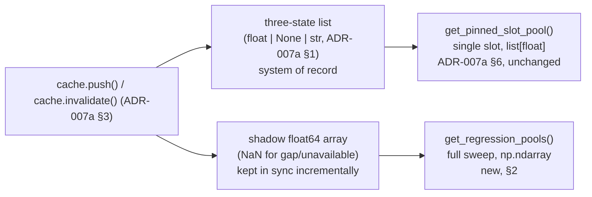

# ADR-008 – Numeric Backend for `regression/`, and a Batched Cache Accessor

**Date:** 2026-08-13
**Status:** Accepted

---

## Context

ADR-000 §2/§6 hold `regression/` to the zero-Home-Assistant-import "pure"
tier, but that classification is about framework independence, not about
staying stdlib-only — `numpy` has no Home Assistant dependency and does not
compromise it. Whether `regression/`'s four strategies (`linear`, `kernel`,
`wls2`, `wls3`; ADR-001 §2) should actually be *implemented* with `numpy`
was left open — ADR-007a defined `cache.py`'s storage and access patterns
without committing to how a caller would turn a training pool into
something `numpy`/the fit routines consume.

Three implementations of the same math were benchmarked — pure Python
(closed-form normal equations for the polynomial strategies; a plain loop
for `kernel`'s locally-weighted average), `numpy` called once per slot
("naive"), and `numpy` called once for a whole batch of slots at once
("batched", ragged pools padded to a common length with zero-weight
entries) — for the two operations that actually matter:

- **The full 288-slot fit sweep** (`linear`/`wls2`/`wls3`), which runs once
  daily or on button press (ADR-002 §1) — not latency-sensitive in
  isolation, but a meaningful implementation-simplicity question either way.
- **`kernel`'s `predict()`**, which — unlike the other three — cannot
  collapse a fit down to fixed coefficients, so it re-computes a
  locally-weighted average over its retained pool on every recompute
  (ADR-002 §2), up to 576 times per string (today-remaining + tomorrow,
  ADR-002 §3), not once a day.

Measured first on x86-64 development hardware, then again on a Raspberry
Pi 5 — the actual target platform — because interpreter-loop and BLAS/SIMD
performance characteristics differ enough between architectures that a
decision made on the former isn't safe to assume for the latter:

| Operation | Pure Python | numpy, naive per-slot | numpy, batched |
|---|---|---|---|
| Fit sweep, `wls3`, 1 string (Pi 5) | baseline | — | **~5× faster** than pure Python |
| `kernel` predict, 576 calls, 1 string (x86) | 5.5 ms | 11.8 ms | 10.1 ms |
| `kernel` predict, 576 calls, 1 string (Pi 5) | 8 ms | 17 ms | 8 ms |

Two findings held on both architectures and drive the decision below:
naive per-slot `numpy` is the worst option in every case measured — its
per-call dispatch overhead never amortizes at these data volumes,
regardless of hardware — and batched `numpy` is never worse than pure
Python. Only the *margin* for `kernel` predict changed: pure Python led
narrowly on x86, but the two are at parity on the Pi 5. Since the Pi 5
number is the one that reflects where Shady actually runs, it is the one
this decision is based on.

---

## Decision

### 1 — Batched `numpy` across all four `regression/` strategies, both `fit()` and `predict()`

With `kernel` predict at parity with pure Python on the target hardware
and the fit sweep clearly favoring `numpy`, there is no remaining
performance argument for giving `kernel` its own pure-Python code path
while the other three strategies use `numpy`. `regression/base.py`'s
shared pool-construction logic (ADR-000 §3) is extended to build one
padded, zero-weight-masked `numpy` array per batch, used by every
strategy's `fit()` (the three polynomial methods; a closed-form normal-
equations solve, batched via `numpy.linalg.solve` across all slots in one
call) and by `kernel`'s `predict()` (a batched locally-weighted average).
One mechanism, one array-construction path, no method-specific exception.

**Naive per-slot `numpy` calls are explicitly rejected as an
implementation choice**, not just a slower alternative — the benchmark
data shows it losing to plain Python as often as it loses to batching, so
it is not a reasonable middle ground between "no numpy" and "batched
numpy."

`numpy` is added as a declared dependency: `manifest.json`'s
`requirements` (`numpy>=1.26.0`, so Home Assistant installs it for the
integration) and `pyproject.toml`'s `[project.dependencies]` (so it's
present for local dev, mypy, and tests too).

### 2 — Regression fitting's accessor: a batched, `numpy`-returning method for the full sweep

Building one target slot's training pool one call at a time — the same
per-slot access pattern `get_pinned_slot_pool` (ADR-007a §6) uses for its
one-slot-at-a-time diagnostics caller — already costs
`2 × smoothing_radius + 1` calls once the neighbor-slot pooling of
ADR-011 §1 is folded in by the caller; doing that for the full 288-slot
sweep
would cost `288 × (2 × smoothing_radius + 1)` calls — 864 with the
default radius of 1 — each returning a small list that a caller would
then convert to `numpy` itself. That is structurally the naive-per-slot
pattern §1 just rejected, so regression fitting's own accessor is never
built that way in the first place — it gets a dedicated, batched method
instead of reusing a per-slot one.

A new accessor is added specifically for the full-sweep case:

```
get_regression_pools(sensor_ids: list[str], smoothing_radius: int) -> dict[sensor_id, np.ndarray]
```

returning, per sensor, one 2-D `float64` array of shape
`(288, window_days × (2 × smoothing_radius + 1))` — the full sweep in one
call, already in the padded shape `regression/base.py`'s batched `fit()`/
`predict()` needs, rather than 864 small lists to be individually
converted and assembled by the caller.

**How `cache.py` builds it without repeated list-to-array copies.**
Alongside each sensor's existing three-state list (`float | None | str`,
ADR-007a §1), `cache.py` now also maintains a shadow `float64` `numpy`
array over the same rolling window, with `NaN` standing in for whatever
the three-state list holds as `None` (not yet fetched / invalidated) or a
`str` reason (a stable "unavailable"-type non-answer). The shadow array is
kept incrementally in sync on every push and invalidate (ADR-007a §3) —
written once, at the point of mutation — rather than rebuilt from the
three-state list on every read. `get_regression_pools` is then built from
strided views/concatenation over this shadow array, not from the
three-state list's per-element `float | None | str` values.



**`NaN` doubles as both "invalid sample" and "pad."** `regression/base.py`
already needs a zero-weight-for-padding mechanism regardless — pools are
ragged whenever the training window hasn't yet reached 28 full days, or a
neighbor slot was excluded (ADR-011 §2), or a clipping exclusion applies
(ADR-003a §1). Deriving that mask as `~np.isnan(pool)` means an invalid
sample and a padding slot are the same case to the batched fit/predict
code — no separate invalid-sample handling path is needed on top of the
padding one that already has to exist.

`get_pinned_slot_pool` (ADR-007a §6) is **unaffected** by this change —
it remains the right tool for the one single-slot consumer that has no
batching to do: ADR-004 §2/§3's diagnostics recompute, which operates on
one pinned (or auto-tracked) slot at a time. Regression fitting has no
per-slot accessor of its own to fall back to; `get_regression_pools`
above is the only way it reads training pools.

**Weight computation stays in `regression/base.py`, not `cache.py`.**
`get_regression_pools` returns raw, padded pools for whatever
`sensor_ids` it is given — `FC`/`PV` for the shading model, and, per
ADR-003c, a weather-forecast-temperature/cell-or-ambient-temperature
pair for the learned temperature forecast; its signature (`sensor_ids:
list[str]`) was already generic before that second use existed. The
magnitude/time/neighbor-distance weighting of ADR-001 §2 / ADR-011 §1
remains
domain logic living outside the storage layer, consistent with `cache.py`
staying pure storage rather than acquiring shading-specific
interpretation (ADR-007's framing). The only change is that this weighting
is now computed as one vectorized pass over the array
`get_regression_pools` returns, instead of accumulated across hundreds of
small per-call lists.

**`kernel`'s `predict()` does not call this accessor on every recompute.**
`fit()` (ADR-002 §1's once-daily/button-press trigger) calls
`get_regression_pools` once and stores the resulting arrays as part of
`kernel`'s `FittedModel`, in the existing per-string/per-slot model-cache
dict (ADR-007a §5's closing paragraph). `predict()` — the hot path, called
on every recompute (ADR-002 §2) — reads those already-cached arrays
directly; it never re-touches the time-series cache.

`get_time_range` (ADR-007a §5's contiguous-range accessor, serving
ADR-005's whole-day arrays and ADR-006's trailing-window sums) is **out
of scope** for this change. Its consumers do simple summation, not a matrix solve or
a per-query locally-weighted average, and no batching problem analogous
to §1's was demonstrated for it. It can receive the same treatment later
if that changes; nothing here forecloses it.

### 3 — How `cache.py`'s three accessors now divide up

Between this ADR and ADR-007a, `cache.py` ends up with three accessors,
each scoped to exactly the consumer(s) that need its shape — no shared,
generically-parameterized method covers more than one of them:

- **`get_time_range`** (ADR-007a §5) — contiguous ranges, for
  ADR-005/ADR-006's summed windows.
- **`get_pinned_slot_pool`** (ADR-007a §6) — one slot, pin-aware,
  `list[float]`, for ADR-004's diagnostics recompute.
- **`get_regression_pools`** (§2 above) — the full 288-slot sweep,
  batched, `numpy.ndarray`, for regression fitting alone.

No method here is a generalization of another; each was sized to its one
caller's actual access pattern rather than to a hypothetical shared
interface.

---

## Consequences

- **Memory.** The shadow array roughly doubles each sensor's time-series
  memory footprint. ADR-007a §1 already established this is small in
  absolute terms — a few hundred KB for the three-state list across
  several sensors — and a `float64` shadow of the same 8064-entry window
  (28 days × 288 slots) is about 63 KB per sensor; negligible next to that
  baseline, for a real reduction in call count and conversion work.
- **The three-state list remains the system of record.** Nothing about
  ADR-007a §1–§4 changes — validity bookkeeping, the `None`/`str`
  distinction, and `trim()`'s behavior are untouched. The shadow array is
  a derived, always-in-sync read optimization, never itself authoritative.
- **Testing.** `get_regression_pools` stays in the zero-mocking pure tier
  (`cache.py` already is, ADR-000 §6) — fixtures with known `NaN`-gap
  patterns can assert the padding/masking behavior directly, no HA
  fixture required.
- **Follow-up, not resolved here.** `get_time_range` could get the same
  `numpy` treatment later if `aggregation.py`'s cross-string sums ever
  show a comparable batching benefit — no evidence of that yet, so it's
  deferred rather than speculatively built now.
