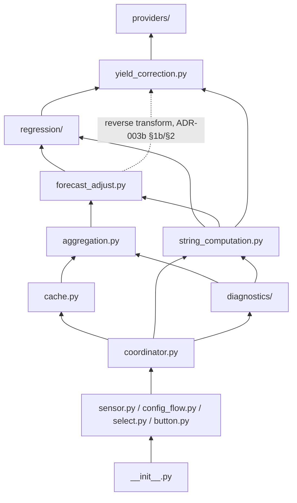

# ADR-014 – `string_computation.py`: A Shared, Pure Per-String Fit/Predict Module

**Date:** 2026-08-31
**Status:** Accepted

---

## Context

`coordinator.py`'s own module docstring describes it as orchestration:
"registers all scheduling triggers... calls the pure layer... pushes
results to sensors" (ADR-000 §3). In practice, by TASK-0014, it had
also accumulated a second job it was never meant to have: the actual
per-string *computation* — training-time corrections
(`_apply_training_corrections`), the regression-method registry
(`_REGRESSION_STRATEGIES`) and the build-pool-then-fit call it backs,
and the predict-then-reverse-transform-then-clamp sequence spread
across `_predict_day_basis`/`_clamp_basis`. None of that is
orchestration — every one of those is pure `NDArray`-in/`NDArray`-out
computation that happens to be *called from* `coordinator.py`, not
computation that *needs* `coordinator.py`'s `hass`/`cache` access to
perform. ADR-000 §3's own module diagram already implies this
separation should exist (`regression/`, `forecast_adjust.py`,
`yield_correction.py` are all listed as pure, called by higher tiers)
but never actually gave the *glue between them* — corrections, method
selection, the fit call, the predict-and-finish call — a home of its
own. It landed in `coordinator.py` by default, growing that module past
its stated scope.

This mismatch surfaced concretely while scoping
`TASK-0015b-diagnostics-select-and-scatter-sensors`
(ADR-004 §4): `CompareRegressionsMode.extra_fit()` needs to fit the
three non-default regression strategies for one slot and turn each
result into a real-world-comparable prediction — precisely the
computation `coordinator.py`'s private methods above already do for the
one configured method, 288 slots at a time. `DiagnosticMode` is
deliberately pure ("imports neither `cache.py` nor `homeassistant.*`",
ADR-004 §5) so it cannot reach into `coordinator.py`'s instance methods
to reuse them, and duplicating that logic inside
`diagnostics/compare_regressions.py` would create exactly the kind of
drifting, independently-maintained second copy ADR-000's whole
module-boundary philosophy exists to avoid. Splitting this computation
out into its own pure module — callable by `coordinator.py` for the
live 288-slot pipeline *and* by `diagnostics/compare_regressions.py` for
a single diagnosed slot, with neither needing `hass`/`cache` access —
resolves both problems in one pass: `coordinator.py` shrinks back
toward orchestration-only, and diagnostics gets a real, non-duplicated
implementation instead of either reaching where it shouldn't or
producing quietly-wrong (reference-condition, not real-world-unit)
numbers.

This ADR is the **source of truth** for `string_computation.py`: its
responsibility, its function signatures, and its dependency direction.
It does not redefine any of the math it wraps — `regression/`'s fitting
mechanics (ADR-001/ADR-008/ADR-011), `yield_correction.py`'s clipping/
derating formulas (ADR-003a/ADR-003b), and `forecast_adjust.py`'s
reverse-transform/clamp ordering (ADR-006 §1b Amendment) all remain
exactly as those documents specify; this ADR only relocates the
*calling code* that ties them together for one string, one target
slot at a time, and names the module that now owns it.

---

## Decision

### 1 — Module responsibility: string-shaped, slot-count-agnostic

`string_computation.py` is pure logic — no `cache.py` import, no
`homeassistant.*` import, zero-mocking tested (ADR-000 §6) — sitting
one layer above `regression/`, `forecast_adjust.py`, and
`yield_correction.py`. Every function takes already-fetched `NDArray`
data and plain scalars/flags as parameters; none of them read `hass`
or `cache.py` themselves. This mirrors `regression/base.py`'s own
"pools are passed in, not fetched" boundary exactly one layer up.

Every function is **slot-count-agnostic**: nothing in this module's
signatures assumes 288 slots, 1 slot, or any other specific count — the
same code path serves `coordinator.py`'s whole-day recalibration sweep
and `CompareRegressionsMode`'s single-diagnosed-slot fit without a
branch or a second implementation, purely because every array
dimension involved (`n_slots`) is the caller's to choose, exactly the
way `regression/base.py`'s own `build_pool`/`fit_weighted_polynomial`
are already `n_slots`-agnostic.

### 2 — What moves here, verbatim in behavior, from `coordinator.py`

Two pieces of already-existing logic relocate from private
`coordinator.py` methods/module-level state into `string_computation.py`
as plain, exported functions — no behavior change, confirmed by the
existing `test_coordinator.py`/`test_coordinator_intraday.py`/
`test_coordinator_temperature_forecast.py` suites passing unmodified
against the refactored call sites (neither is any other task's declared
Consumed Interface — both are `coordinator.py`-private, so relocating
them is ordinary same-module refactoring, not a Scenario C interface
break):

- **`REGRESSION_STRATEGIES: dict[str, ModuleType]`** — the
  method-name → `regression/` module registry, previously
  `coordinator.py`'s private `_REGRESSION_STRATEGIES`. Made an exported
  module-level constant here (not private) because `diagnostics/
  compare_regressions.py` (§4) needs to iterate *all four* entries,
  where `coordinator.py`'s own configured-method lookup only ever needed
  one.
- **`apply_training_corrections(fc_by_offset, pv_by_offset,
  temperature_by_offset, temperature_tier, converter_limit_w,
  clipping_threshold, coefficient_per_c, provider_already_corrects,
  rated_dc_capacity_wp, max_uplift_c) -> dict[int, NDArray[np.float64]]`**
  — previously the private, `_StringConfig`-bound `coordinator.py`
  method of the same name (minus the `apply_` prefix). Same clipping-
  then-derating order, same per-offset loop (ADR-003a §1/§1a, ADR-003b
  §1/§1a). De-methodized: every value the original read off `self`/
  `string` is now an explicit parameter, so this function has no
  dependency on `coordinator.py`'s `_StringConfig` type at all.

### 3 — What's new: `fit_string_model` and `predict_string_forecast`

Two functions that did not exist as named units before — each one
factors out a pattern that was previously **inlined twice** in
`coordinator.py` (`_fit_string`/`_fit_temperature_string` for the first;
`_predict_day_basis`/`_clamp_basis` for the second), and is now needed a
*third* time, for diagnostics, which is precisely what makes extracting
it worthwhile rather than inlining it a third time too:

- **`fit_string_model(fc_by_offset, corrected_pv_by_offset,
  smoothing_radius, neighbor_fitting_cutoff, recency_decay_max, method:
  str, *, apply_magnitude_weight: bool = True) -> FittedModel`** — looks
  `method` up in `REGRESSION_STRATEGIES`, calls `regression.base
  .build_pool(...)`, then that strategy's `fit(pool)`. Replaces the
  identical three-line sequence previously written out separately in
  `_fit_string` (the shading model, `apply_magnitude_weight=True`) and
  `_fit_temperature_string` (the temperature-forecast model, ADR-003c
  §2, `apply_magnitude_weight=False` — `TASK-0005-patch-5`).
- **`predict_string_forecast(model: FittedModel, fc: NDArray[np.float64],
  target_cell_temperature: NDArray[np.float64] | None, coefficient_per_c:
  float, provider_already_corrects: bool, inverter_limit: float | None) ->
  NDArray[np.float64]`** — calls `forecast_adjust
  .reverse_transformed_forecast(...)` then `forecast_adjust
  .clamp_output(...)`, in that fixed order (ADR-006 §1b Amendment's
  canonical ordering: raw-predict → reverse-transform → exactly-one
  final clamp). Replaces `_predict_day_basis`'s reverse-transform step
  plus `_clamp_basis`'s clamp step, previously two separate calls a
  caller had to remember to chain in the right order; now one call that
  cannot be chained wrong. This is the literal "turn a fitted model and
  a raw forecast value into the actual (corrected) forecast" step —
  the reason this module is named for the *computation*, not just the
  *fitting*, half of what a string's forecast needs.

Both are pure `NDArray`-in/`NDArray`-out (or `NDArray`-out from plain
scalars/dicts) — no assumption about which caller is invoking them, no
`n_slots` restriction (§1).

### 4 — `coordinator.py`'s new, narrower role

`_fit_string`, `_fit_temperature_string`, `_predict_day_basis`, and
`_clamp_basis` all keep their existing signatures and existing callers
unchanged — no other task's Consumed Interfaces reference any of them,
so nothing downstream needs to change. Their *bodies* shrink to: gather
the raw arrays from `cache.py`/`providers/` (the genuinely impure half —
`get_regression_pools`, `provider.fetch()`), then delegate everything
else to `string_computation.py`. `_apply_training_corrections` as a
`coordinator.py` method is removed outright — every call site now calls
`string_computation.apply_training_corrections(...)` directly, passing
the string's own config fields as explicit arguments instead of
implicitly reading `self`/`string`.

`coordinator.py`'s remaining responsibility, after this split, matches
its own module docstring's original claim for the first time: registers
triggers, reads from `cache`/`providers` (impure), calls
`string_computation.py` (pure), writes results back to `cache`/`Store`
(impure). No net change in what any sensor displays or what any test
observes — this is a pure internal reshuffling of *where* the
computation lives, not *what* it computes.

### 5 — `diagnostics/compare_regressions.py`'s new dependency

`CompareRegressionsMode.extra_fit()` (`TASK-0015b`) calls
`string_computation.fit_string_model` (once per regression method, all
four) and `string_computation.predict_string_forecast` directly — a
pure module calling another pure module, no boundary violation, and no
duplicated fitting/reverse-transform logic. `coordinator.py` still owns
gathering the diagnosed slot's raw training arrays (via `cache.py`'s
`get_pinned_slot_pool`, ADR-007a §6) and the resolved temperature target
value (via `providers/`, the same way `_predict_target_slot_temperature`
already does for the live pipeline) — that gathering step is exactly as
impure as it already was; only the *computation on top of it* moves to
where `diagnostics/` can legitimately reach it too. The updated
module diagram (ADR-000 §3, amended alongside this ADR):

The `diagnostics --> regression` edge ADR-004's 2026-08-30 amendment
introduced is replaced by `diagnostics --> string_computation` — the
prose claim ("Calls `regression/` for its own extra per-slot fitting")
is now realized *through* `string_computation.py` rather than by
`diagnostics/` reaching past it into `regression/` directly.

### 6 — Why not just inline this a third time, or put it in `coordinator.py`

The alternative this ADR rejects — leaving `_apply_training_corrections`
et al. in `coordinator.py` and writing a third, diagnostics-specific
copy of the same fit/predict sequence inside
`diagnostics/compare_regressions.py` — was rejected for the same reason
ADR-012 rejected a third hand-rolled provider listener: three
independently-maintained copies of "corrections → fit → reverse-
transform → clamp" drift the moment exactly one of them gets a bug fix
the other two don't (the same class of bug `TASK-0005-patch-2`
originally caught and fixed once, project-wide, by consolidating
`predict()`'s clamp step into `regression/base.py`'s shared
`FittedModel` — this ADR applies that identical lesson one layer up).

---

## Consequences

- `coordinator.py` shrinks by roughly the size of
  `_apply_training_corrections` plus the duplicated build-pool/fit and
  reverse-transform/clamp sequences it no longer inlines — a genuine
  reduction in how much business logic that module carries, not just a
  relocation for its own sake.
- `string_computation.py` joins ADR-000 §6's zero-mocking pure-tier
  module list, alongside `regression/`, `forecast_adjust.py`,
  `yield_correction.py`, and `aggregation.py`.
- `diagnostics/compare_regressions.py` (`TASK-0015b`) gets a real,
  non-duplicated, unit-correct (real-world, not reference-condition)
  implementation for its four-method comparison, with no purity
  exception carved into `DiagnosticMode`'s own "no `cache.py`, no
  `homeassistant.*`" rule.
- **Con:** one more module in the dependency chain between
  `coordinator.py` and `regression/`/`forecast_adjust.py`/
  `yield_correction.py` — a caller tracing "where does the actual math
  happen" now passes through one additional file. Judged worth it: the
  alternative was either a growing `coordinator.py` or a duplicated
  diagnostics-only copy of the same math, both worse.
- **Con:** `fit_string_model`'s `method: str` parameter is validated
  only by `REGRESSION_STRATEGIES` dict lookup (a `KeyError` for an
  unrecognized name) — no new validation layer was added, since every
  existing caller already only ever passes a value that
  `const.py`'s `REGRESSION_METHODS`/config-flow validation already
  constrains, and `diagnostics/compare_regressions.py`'s own call sites
  iterate `REGRESSION_STRATEGIES`'s own keys directly rather than
  supplying an independently-sourced name.
